```{r setup, include=FALSE, message=FALSE, warning=FALSE}
knitr::opts_chunk$set(echo = FALSE, warning=FALSE, message=FALSE)
library(tidyverse)
library(dplyr)
library(ggplot2)
library(purrr)
library(lubridate)
```

## Introduction

Neurobiological data is inherently complex–high-dimensional, noisy, and full of poorly-characterized interacting components. With recent innovations in machine learning demonstrating rapid and powerful performance on large biological datasets [2], the natural question of the role of transformer architecture in modeling neurobiological data arises. Can a transformer better model this type of data than dimensionality-reducing approaches such as PCA? <br>
To investigate this question, we turned to a dataset originally produced by Steinmetz et al. [1]. Steinmetz used Neuropixels probes–a neural recording system–in order to track over 30,000 neurons across 42 brain regions in mice performing a visual discrimination task, with the objective of unifying brain-wide information to elucidate broader patterns in mouse decision-making. Mice were fixed into position and presented with two screens displaying combinations of black-and-white contrast levels with values $\{0, 0.25, 0.5, 1\}$, with 1 acting as a full stimulus. In reaction, the mice were to turn a wheel in the direction of the stronger contrast, being rewarded for a correct choice. If the contrast was equal, reward was random; if no stimulus was presented, non-action was rewarded. This binary decision making process is modeled as a feedback type from the mouse, with success equating ($1$) and failure equating ($-1$). Neuropixels provided spiking data {0,1} across a random collection of individual neurons across 40 standardized time bins. Given single-trial-level information with a feedback in $\{-1, 1\}$, left contrast right contrast in $\{0, 0.25, 0.5, 1\}$, and 40 time bins of neural spike data, our objective is to predict mouse decisions. <br>
Given that a transformer is optimized for sequential data [3], we hypothesize it to be an appropriate architecture by which to model this data. Steinmetz et al. note that mouse action seems to be dependent on a chain of events between disparate brain regions, with general excitation, excitation of key decision-making neurons, propagation from the visual cortex to the rest of the brain, and other features being found to influence the ultimate correctness of mouse decision-making. This potentially implies nonlinear temporal information that would be typically ablated by PCA,  or other dimensionality reduction techniques, as they rely on orthogonal projections that do not lend consideration to sequential effects. In order to evaluate positionally-encoded transformer performance on modeling decision-making processes, we engineered several feature sets comprised of univariate trial-level statistics, rolling-window trial-level statistics, and several features informed by an exploratory data analysis, such as a set of features related to brain regional autocorrelations. <br>
Unfortunately, due to the critical failure of several assumptions made during this model-building process, which overfit it to a flawed training dataset, validation data confirms our model to hold almost no significant predictive power. This report will analyze precisely why our model failed and will suggest future directions for exploration and refinement. We will detail an exploratory data analysis that was used in substantiating our approach, a data integration phase that hinged on several wrongful assumptions, and a predictive modeling exercise that acts as an excellent study for the dangers of overfitting to a dataset. A discussion concerning practical improvements follows.

## Exploratory data analysis
### Data Structure
18 experimental sessions were analyzed, with each having information on the mouse being tested and the date of the experiment. Each session is a set of trials from the same mouse, where one trial corresponds to one mouse response. Accordingly, each trial has the following data: feedback type, left contrast, right contrast, brain regions corresponding to each recorded neuron, raw times, and 40 time-binned spikes per neuron. Each spike is a binary excitation in $\{0, 1\}$. <br>
Across sessions, task structure–for example, contrast levels and the number of time bins–is preserved. Though raw times differ slightly, this is a byproduct of inconsistent delays between stimulus and mouse response; time bins instead represent a homologous range of times, from the beginning of the mouse response to the end. Within sessions, the actual neurons surveyed, along with their respective brain regions, are preserved. <br>


Across sessions, the majority of experimental structure remains constant–for example, contrast levels and the number of time bins are preserved. While raw times differ between trials on account of inconsistent mouse response times to stimuli, binning regularizes the data into the same range of 0.39 seconds, split between 40 time bins. Within sessions, the neurons surveyed along with their respective brain regions are preserved. <br>
Unfortunately, the similarities stop there. Each session has a different number of associated trials [Fig. 1], with a varying number of neurons surveyed [Fig. 2].

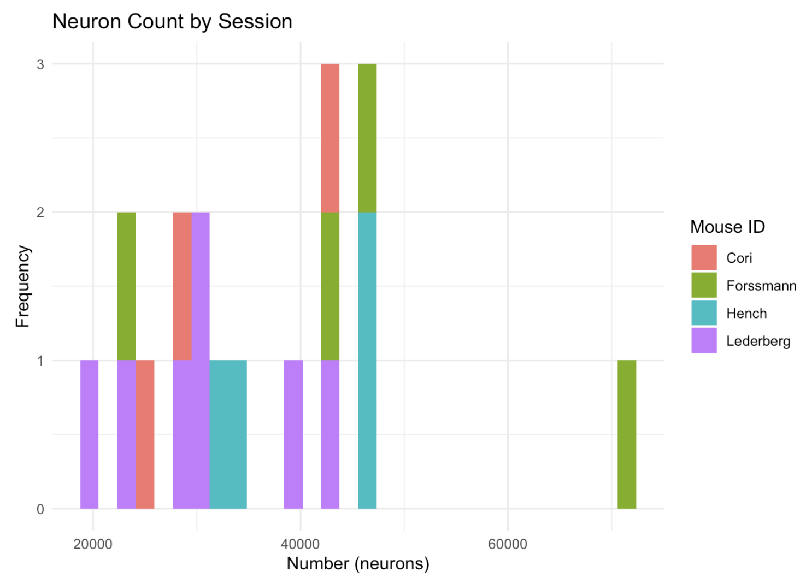 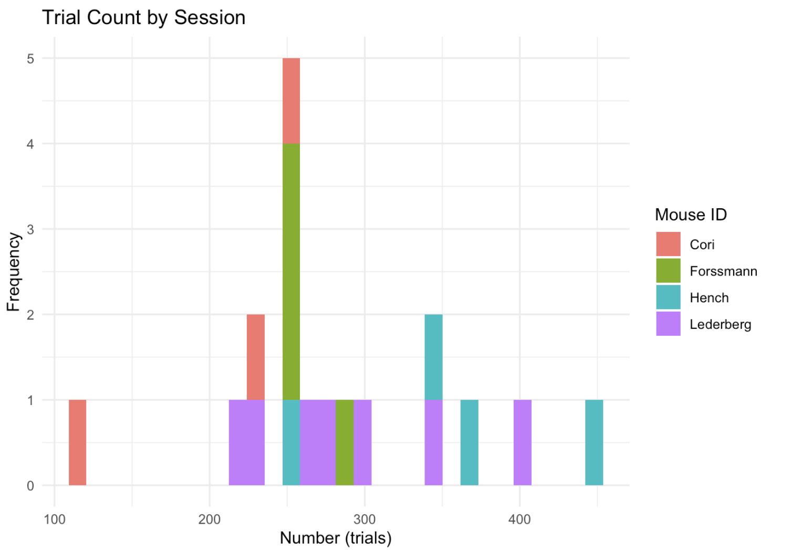 <br>

*Figure 1, Figure 2. Variable trial and neuron counts by session.* <br>

There also exist no conserved brain regions across sessions, a unique challenge when attempting to understand interregional patterns in neural communication. There also exist 4 different mice, potentially introducing individual-level differences into the data. <br>
As well, several imbalances exist in the data. Of particular note are varying counts of trials involving each contrast left-right pair [Fig 3]. Each contrast left-right pair resulted in a different average success rate across sessions [Fig 4]. This presents a promising source of structure in the data, substantiating the use of left-right contrasts as a feature in our modeling.

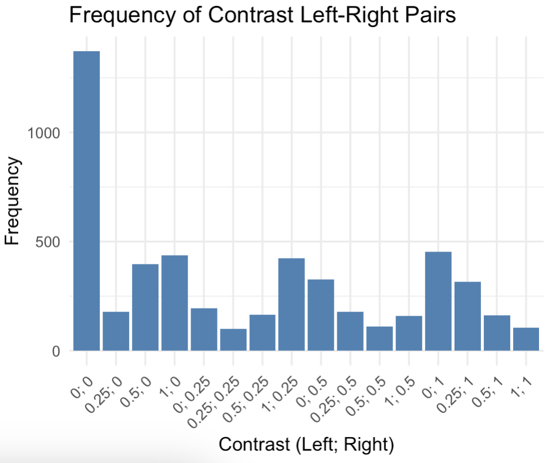 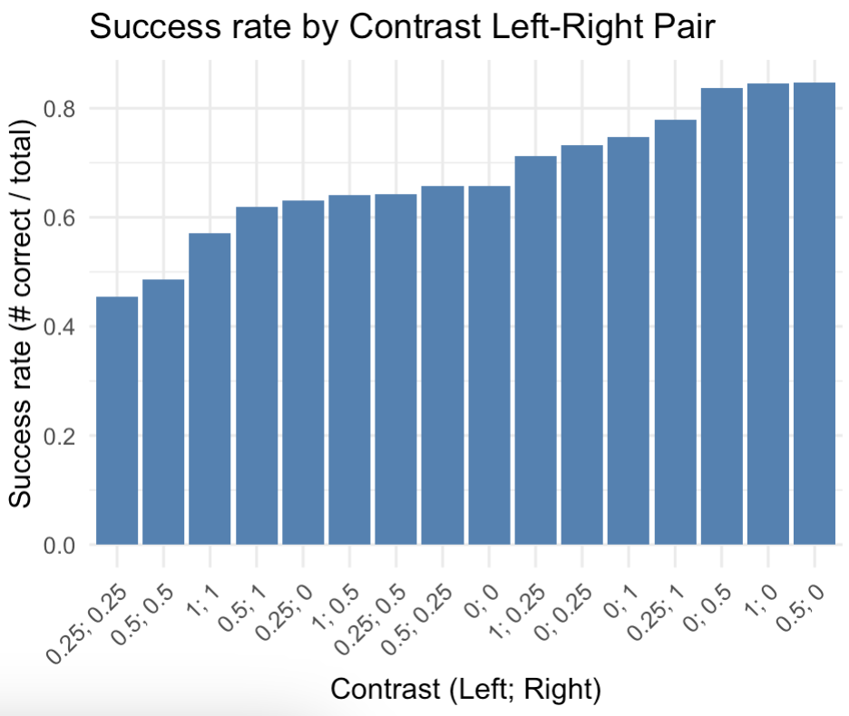 <br>

*Figure 3, Figure 4. Variable L/R permutations counts. Variable success rates per permutation.* <br>

Concerningly, trials resulting in successful feedback greatly outnumber those resulting in failure; no L/R permutation groups other than $\{0.25, 0.25\}$ and $\{0.5, 0.5\}$ have an average success rate below 50%. This would bias a transformer model’s baseline to performing at better than random chance while extracting no usable structure from the data. This highlights an important consideration with respect to balancing input data, which will be addressed and further discussed in the Data Integration section. 

Overall, these differences in session-level information pose a difficult question with respect to integration because transformers rely on dimensionally-consistent data [3]. We are precluded from directly utilizing neural spike data without losing generality between sessions. Therefore, a series of descriptive statistics and other features surviving generalization across sessions are needed; a discussion on their identification follows.

### Descriptive Statistics

### Session 5: A Case Study Into Autocorrelation
Though brain regions differ between sessions, we were interested in maintaining some degree of information from them in our modeling, as our rationale for utilizing a transformer partially rests on the identification of long-range temporally-relevant features. Autocorrelation, or serial correlation, is a quantification of a random variable’s similarity with its own previous time states. By aggregating neurons according to brain region in Trial 11 of Session 5 and calculating their average regional autocorrelations, interesting patterns resembling sinusoidal brain waves were made observable [Fig. 5]. 

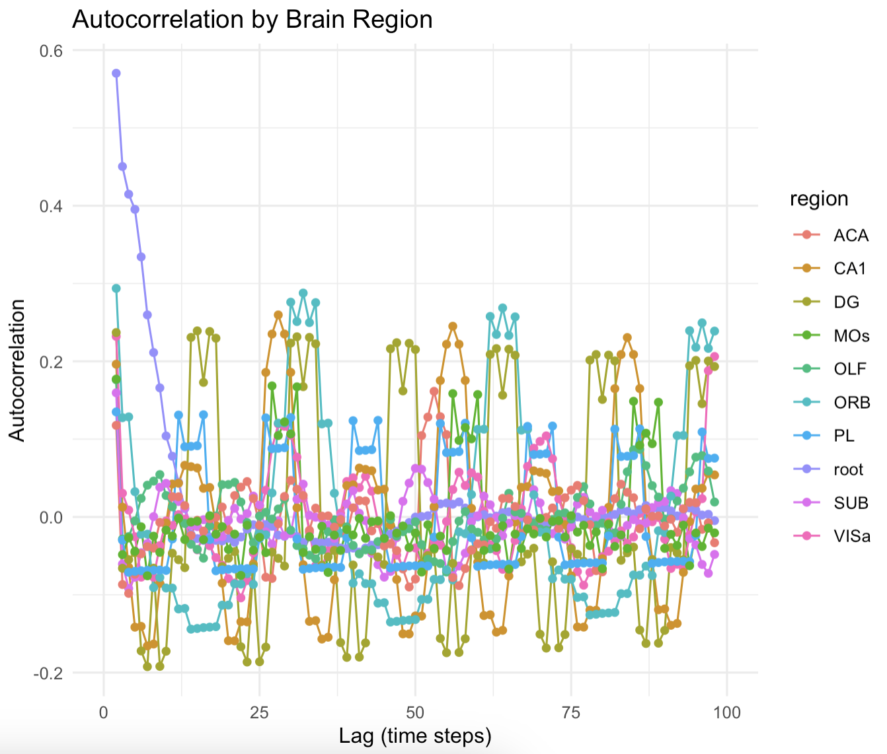 <br>

*Fig 5. Autocorrelation by brain region in trial 11 of session 5.* <br>

To assess feature potential, trials in Session 5 were aggregated according to feedback type and corresponding spike data was segregated according to brain region. Plotting average autocorrelations in brain regions once more, a clear structural difference was observable between successful and unsuccessful mouse decisions in several brain regions (CA1, DG, MOs, OLF, ORB, PL, SUB) [Fig. 6]. Moreover, correlations between average regional autocorrelations were found to exhibit structural differences between trials with different types of feedback [Fig. 7, 8]. This suggests that there exist meaningful structural differences not only in the way brain regions behave over time, but also in the way that brain regions interact over time. We hypothesized this could be an interesting feature to extract regional information across many sessions, since correlations between brain regions could potentially be generalizable despite a differing number of brain regions between sessions. A discussion on implementation will follow in the Data Integration section.

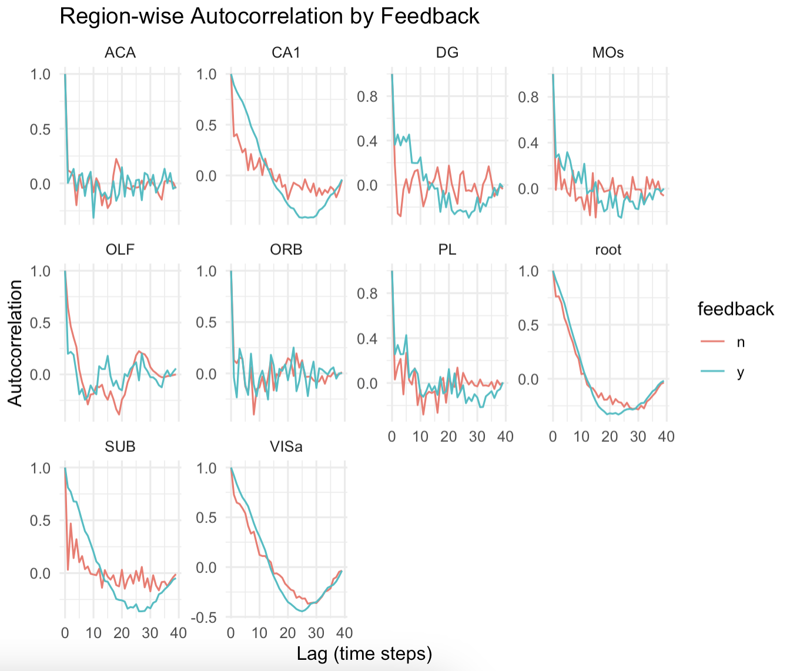 <br>

*Fig 6. Average autocorrelations by brain region across trials of session 5.* <br>
<br>

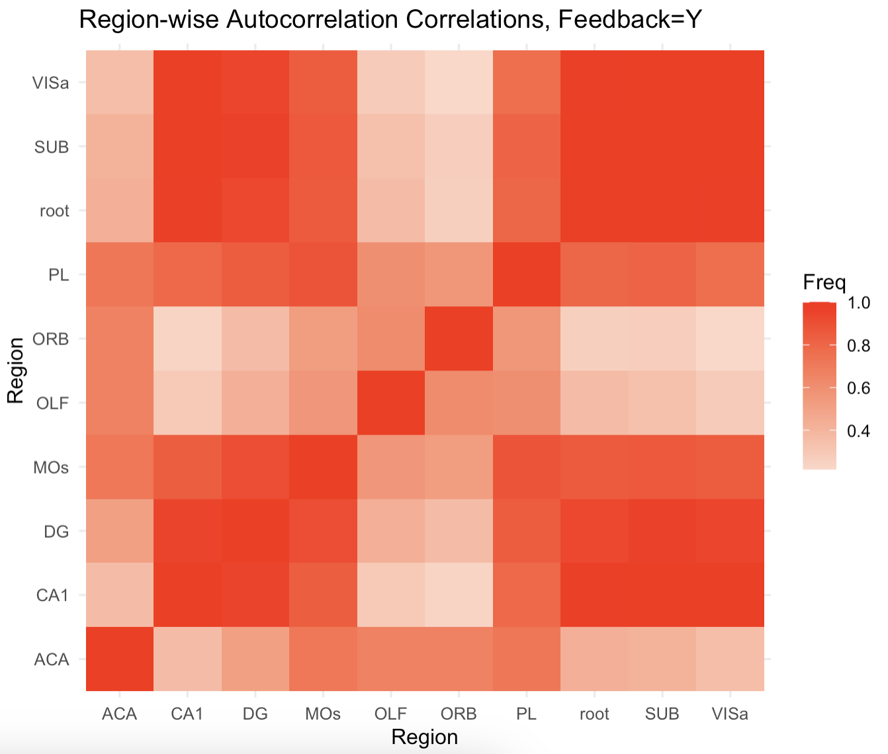 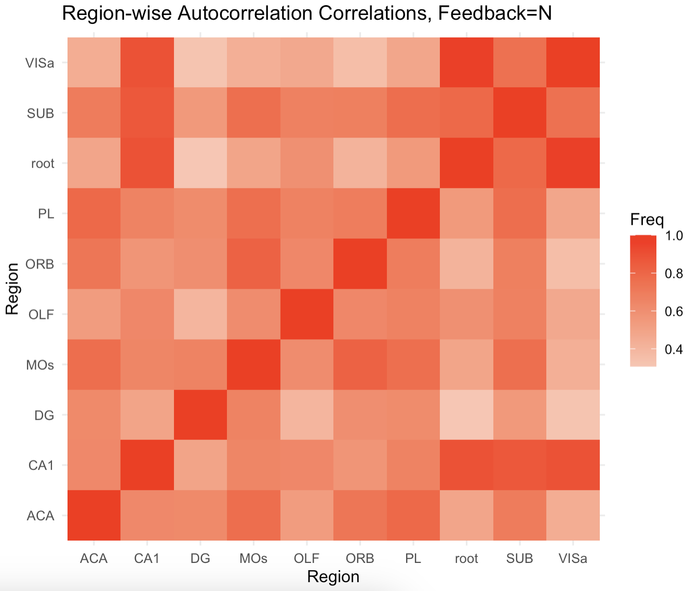 <br>

*Fig 7, Fig 8. Region-wise correlations in autocorrelation, between successful and unsuccessful mouse feedback.* <br>

## Data Integration
### Data Preparation
The data structure described earlier in exploratory analysis was packaged as a series of lists, with sessions containing a list of session-level information, each session acting as a list of trials, each trial acting as a list of trial-associated data, with trial data also being encoded as lists. The first step in our data integration was the conversion of the native data structure into a list of unified tibbles [4]. An example of the resultant data structure is depicted.

```{r}
session_to_tibbles <- function(session) {
  trials <- lapply(seq_along(session$spks), function(i) {
    t <- tibble(
      neuron_id = seq_len(nrow(session$spks[[i]])),
      region = session$brain_area,
      feedback = session$feedback_type[[i]],
      contrast_left = session$contrast_left[[i]],
      contrast_right = session$contrast_right[[i]],
      mouse_name = session$mouse_name,
      as_tibble(session$spks[[i]])
    )
    
    return(t)
  })
  
  trials <- lapply(trials, function(trial) {
    colnames(trial)[7:46] <- paste0('t', 1:40)
    return(trial)
  })
  
  return(trials)
}
load_sessions <- function() {
  sessions <- list()
  for (i in 1:18) {
    sessions[[i]] <- readRDS(paste("Data/session", i, ".rds", sep=""))
  }
  
  # Explicitly remove session 1 & 18 because they are used for validation data
  sessions <- sessions[-c(1,18)]
  
  sessions <- lapply(sessions, function(s) session_to_tibbles(s))
  return(sessions)
}
# load_unified_sessions()
# @param: n/a
# @returns: a single list of all trials from all sessions as tibbles
load_unified_sessions <- function() {
  sessions <- load_sessions()
  unified <- unlist(sessions, recursive=FALSE)
  return(unified)
}
sessions <- load_unified_sessions()
print(sessions[[1]])
```

Sessions 2 through 17 were combined into this new data structure, with Sessions 1 and 18 remaining fully untouched for future use in validation. Because one of the core metrics of this model is performance on a subset of Sessions 1 and 18, including their data in the model would result in data leakages, meaning the model could directly encode their results and therefore bypass needing to apply real structural insights in predicting their trials’ results. <br>
Given that exploratory data analysis concluded successful trials were significantly more common than unsuccessful trials in our data, which is prohibitive to learning real structure in a transformer model, an appropriate balancing schema was necessary to identify. Trials with unsuccessful mouse decisions were replicated to match the quantity of successful trials with a small noise level of 0.01, which governs the probability of randomly flipping binary values in every neuron’s spike data. This effectively adds weight to our unsuccessful trials. <br>
This schema was critically unsuccessful, but evaded detection on account of insufficient background information concerning modeling. Additional information will follow in the Predictive Modeling and Discussion sections. <br>
In addition, because all model training relies on contrasting a training set with a validation set, a 90/10 split into training and validation sets was performed. <br>

### Summary Statistic Mining
Based on our exploratory data analysis, a wide range of summary statistics were selected. Each summary statistic is a 40-vector of its value per each time bin unless stated otherwise. Each statistic along with its rationale for inclusion are tabulated below.

| Feature | Rationale |
| ------- | --------- |
| Left contrast | Strong correlation between left contrasts and mouse success rate found in exploratory analysis. 40-vector made from a 40x repetition of trial-level left contrast value. |
| Right contrast | Strong correlation between right contrasts and mouse success rate found in exploratory analysis. 40-vector made from a 40x repetition of trial-level right contrast value. |
| Overall mean | General excitation level reported to be relevant in the original Steinmetz paper. An overall mean acts as a heuristic for how active the brain is at a given time point. |
| Overall standard deviation | The standard deviation of mean neuron spiking could be relevant in that it roughly characterizes the distribution of activated neurons, potentially helping to distinguish differences in types of excitations. |
| Overall skewness | The skewness of mean neuron spiking could be relevant in that it roughly characterizes the distribution of activated neurons, potentially helping to distinguish differences in types of excitations. |
| Overall kurtosis | The kurtosis of mean neuron spiking could be relevant in that it roughly characterizes the distribution of activated neurons, potentially helping to distinguish differences in types of excitations. |
| Overall 1st derivative of mean | The rate of change of the mean activation could help characterize the strength of generalized excitation. |
| Overall 2nd derivative of mean | The second derivative of the mean activation could help characterize the rate of change of the strength of generalized excitation. |
*Table 1. Univariate summary statistics.* <br>
<br>

Altogether, the objective with including univariate statistics was to provide the model with general information on simple neural excitation, a factor that Steinmetz et al. pointed out as having significance [1]. In addition to these statistics, a number of rolling-window statistics were selected in hopes of providing temporal information to the transformer. All rolling-window statistics were provided in triplicate, with windows 3, 7, and 10 time bins large. <br>

| Feature | Rationale |
| ------- | --------- |
| Rolling mean | Captures temporal information in neural activation, potentially helping a model learn how different feedback types affect time-dependent excitation patterns. |
| Rolling standard deviation | Helps roughly characterize the distribution of rolling mean neural activation. |
| Rolling kurtosis | Helps roughly characterize the distribution of rolling mean neural activation. |
| Rolling skewness | Helps roughly characterize the distribution of rolling mean neural activation. |
| Rolling first derivative of mean | Captures temporal information in the rate of change in neural activation, potentially helping a model learn how different feedback types affect time-dependent rates of change in general excitation. |
| Rolling second derivative of mean | Further characterizes the rate of change in neural activation, potentially helping a model learn how different feedback types affect time-dependent rates of change in general excitation. |
*Table 2. Rolling-window statistics.* <br>
<br>

### Regional Effects
Exploratory analysis suggested that interregional correlations could make for a valuable feature despite difficulties in generalizable implementation. To attempt to capture a heuristic for regional information, the first four eigenvalues for the correlation matrix of average regional autocorrelations were calculated. <br>
Each regional set of neural spikes yielded a 40-vector of average autocorrelations. These represent the average correlation between average neural activations per region with their earlier time states; that is, how closely the current state of a brain region is correlated to its past states. Between each regions’ autocorrelations, a correlation matrix was calculated, similarly to what was depicted in [Fig 7, 8]. Because the global minimum for the count of non-missing brain regions per session was found to be 4, the first 4 eigenvalues could be reliably collected without concern for loss of generality. <br>
These 4 eigenvalues encode the dominant modes of variability in the correlation matrix, effectively providing a low-dimensional representation of the correlation–or “agreement”–between brain waves. In order to attempt to capture temporal information in this correlation, a rolling window of 3, 7, and 10 was calculated for these eigenvalues. Though potentially complicated and experimental, we had hoped this set of features preserve generalizability while providing some insight into temporal interregional dynamics; the ultimate lack of utility in this feature will be discussed in the Predictive Modeling and Discussion sections of this paper.

### Positional Encoding
Because transformers do not have a native method for differentiating between the positions of sequential data–that is, a transformer does not have the architecture to conceptualize that two timepoints further away from one another are temporally different from two closer timepoints [3]–positional encoding is necessary to preserve information about the order of timepoints. A well-known method to achieve this is through sine-cosine positional encoding, where varying frequencies of a sine and cosine curve are used to communicate both short-term and long-term differences between two time points [5]. Referencing a practical guide on positional encoding [6], we implemented a 40-dimensional positional encoding per each timepoint. <br>

In summary, 6056 trials of 40 timepoints each with n parameters (n=82 for the full model; 40 positional encoding rows, 42 features) were combined into (6056 x 40 x n) tensors, which can be thought of as multi-dimensional vectors. These tensors serve as the basis for our predictive modeling. <br>


## Predictive Modeling
To validate the model as learning true transformer-relevant structure, two controls were implemented: <br>

(1) A logistic regression on a principal component analysis of our data was conducted as a linear baseline. Tensors were unwrapped into a 2D structure to facilitate this regression. For the full model, logistic regression correctly classified validation trials 76.4% of the time. In retrospect, this is inordinately high for what was assumed to be nonlinear data and should have acted as an alert to something wrong with the dataset. <br>
(2) Feedback labels were shuffled to ensure no clear bias was included in our data. When shuffling labels, the expectation is that the model is no longer able to make predictions with better accuracy than random guessing, which for our binary classification means we expect to see roughly 50% accuracy following shuffling. If there were to be biases in the data–for example, a 70/30 unbalance between types of feedback in our trials–the likelihood of a random guess yielding the correct trial outcome rises to 70%. This would express itself as an unjustifiably high prediction accuracy in our model, despite this confidence not reflecting any true structure to the data. For each of our assessed models, shuffling labels did not produce significantly higher accuracy than ~50%, validating this control. <br>

Additionally, the following measures were taken to avoid several common pitfalls: <br>
(1) Prior to every model training, our data was filtered for any overlapping trials between training and validation datasets. This confirms no data leakage, permitting additional confidence in our transformer learning real structure. <br>
(2) The correlation between each feature in the data and feedback type is calculated, with the top 20 being displayed. This ensures that no feature accidentally encodes information about feedback type, which acts as a guardrail against human error (e.g. variable misnaming leading to feedback type being encoded in place of left/right contrasts). If no single feature exhibits significantly higher correlation with feedback than random guessing (0.5), then we can be confident the model must learn structure in the data to make accurate predictions. <br>

A transformer model was implemented using PyTorch with the following initial hyperparameters (Table 3). A typical output with the considerations discussed above is depicted in [Fig. 9].

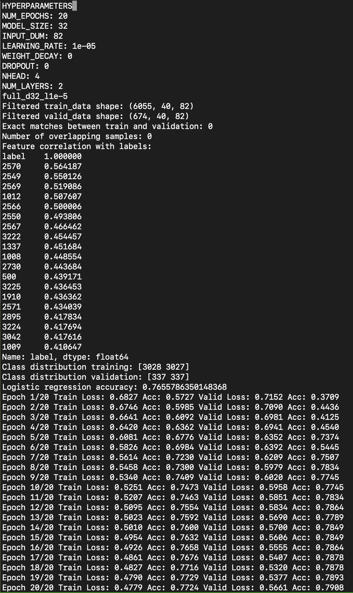 <br>

*Figure 9. Full 32-d model with learning speed of 1e-5 trained over 20 epochs.* <br>
<br>

| Parameter | Value | Explanation |
| --------- | ----- | ----------- |
| Embedding size | 32 | The embedding size of the model is the dimensionality of the input embeddings entering the model. Each feature/token is converted into a vector of this size. 32-d is a fairly modest encoding size that was chosen on account of a relatively small dataset. |
| Number of layers | 2 | The number of layers in the model is the number of encoding blocks employed by the transformer. More layers roughly translates to learning more complicated relationships in a dataset. Because of the dimensionality reduction expected in the data from our mining scheme, a small layer size of 2 was chosen to start with. |
| Attention heads | 4 | The number of attention heads is roughly the number of ways in which tokens are considered to be related to one another prior to updating their relationships. More attention heads translates to additional focus being given to nonlinear relationships in the data. As before, a conservative number of 4 heads was selected to begin with. |
| Dropout | 0 | A parameter dictating the proportion of neurons to drop from the transformer on every iteration of the model. By forcing such a dropout, the model can more efficiently escape local minima by being forced not to rely on any one specific neuron. It is typically employed to address overfitting onto training data. Because we saw no evidence of such overfitting, dropout was never employed in any of our models. |
| Weight decay | 0 | A parameter dictating the regularization of large weights in the model. By forcing large weights to be reduced, the model can be prevented from overfitting to any one parameter. As with dropout, this parameter was not employed. |
| Learning rate | 1e-5 | A parameter dictating the maximum updates the model can make to its weight per training cycle (epoch). A smaller value was chosen in order to aim for stable models, at risk of larger numbers of epochs being required to converge to the models' empirical limits. |
| Loss function | Binary cross-entropy | A loss function measures how the model's predictions match actual labels. Binary cross-entropy is a common loss function for use in binary classification problems. |
| Optimizer | AdamW | An optimizer calculates weight updates for a model. AdamW is one such common updating utility. |
<br>
*Table 3. Explanation of transformer hyperparameters and starting values. These parameters went on to be used in our "full" model.* <br>
<br>

Feedback was separated from the data to act as an answer key for the model’s predictions. This model was trained for 20 epochs–that is, 20 full passes through the training dataset, with the model refining itself each time–to allow the model to stabilize and assess preliminary stability and characteristics. Accuracy and loss of the training and validation sets are displayed in [Fig. 10].Though the model’s accuracy peaked at around 78.5%, ostensibly demonstrating clear structural learning, concerns about stability and the modest improvement over a simple logistic regression prompted an exploration of alternative hyperparameters and feature subsets. A 64-dimensional model was attempted for this full dataset, but it quickly failed to converge. <br>

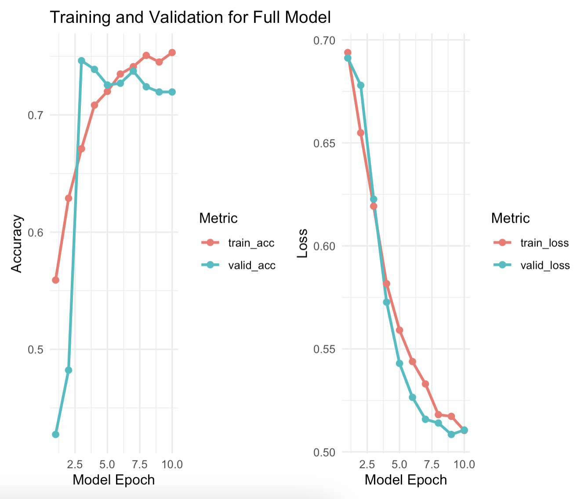 <br> 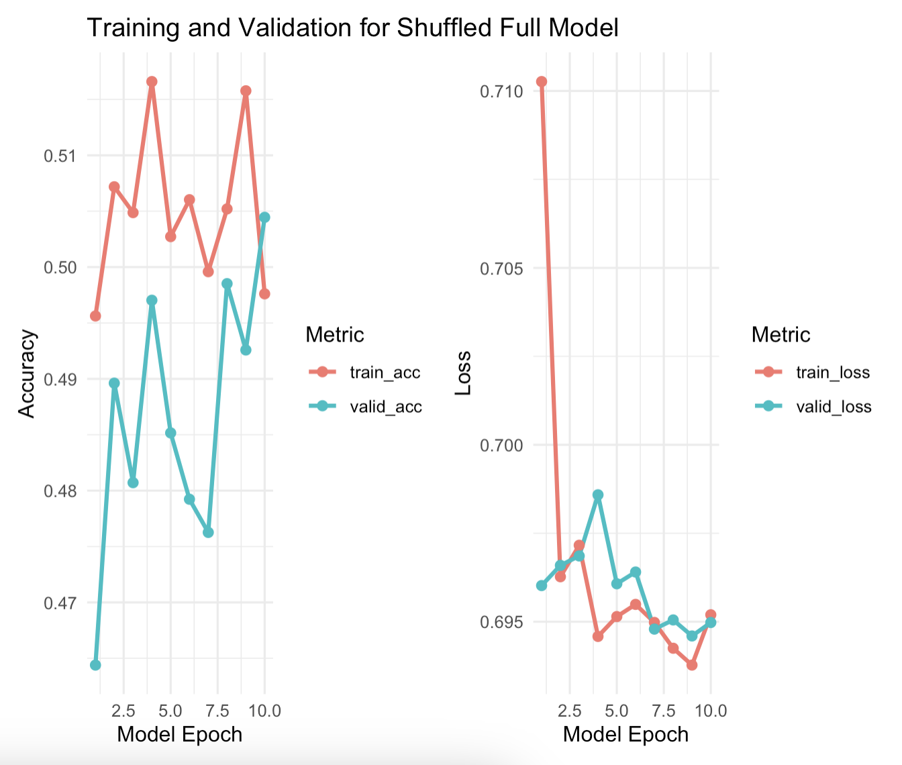 <br>

*Figure 10. Training and validation curves for full model and shuffled full model.* <br>

### Partial Models and Hyperparameter Tuning

Though transformers are a black box model, the relative importance of model features may still be identified through ablation studies, where certain features or feature categories are dropped to assess the resultant model performance. Of particular interest to us was an evaluation of the following: <br>

(1) The utility of univariate statistics; <br>
(2) The utility of rolling-window “basic” statistics–mean, standard deviation, skewness, kurtosis; <br>
(3) The utility of interregional eigenvalues; <br>
(4) The optimal configuration of hyperparameters for our modeling. <br>

To substantiate these, the following 9 models were evaluated. They are tabulated below with their hyperparameters and other relevant results. Selected graphs of their training and validation data are displayed. <br>

| Features selected for model | Hyperparameters (variable name) | Logistic regression predictive accuracy | Transformer predictive accuracy at 20th epoch | Corresponding figure |
| --------------------------- | ------------------------------- | ---------------------- | -------------- | --------- |
| Full model minus all univariate statistics (“no_globals”) | Model size (d): 32 <br> Learning speed (speed): 1e-5 <br> Attention heads (heads): 4 <br> Layers (layers): 2 <br> | 75.52% | **75.52%** | [Fig. 12] |
| “no_globals” | d: 32 <br> speed = 1e-4 <br> heads = 4, layers = 2 | 75.52% | **77.15%** | [Fig. 13] |
| “no_globals” | d = 32 <br> speed = 1e-5 <br> heads = 8, layers = 4 | 75.52% | **78.34%** | [Fig. 14] |
| “no_globals” | d = 64 <br> speed = 1e-5 <br> heads = 4, layers = 2 | 75.52% | **55.34%** | [Fig. 15] |
| Rolling derivatives, eigenvalues, and left/right contrasts (“der_eigen_lr”) | d = 32 <br> speed = 1e-5 <br> heads = 4, layers = 2 | 74.18% | **79.38%** | [Fig. 19] |
| “der_eigen_lr” | d = 64 <br> speed = 1e-5 <br> heads = 4, layers = 2 | 74.18% | **79.38%** | [Fig. 16] |
| Rolling derivatives and left/right contrasts (“der_lr”) | d = 32 <br> speed = 1e-5 <br> heads = 4, layers = 2 | 72.10% | **79.23%** | [Fig. 17] |
| Eigenvalues and left/right contrasts (“eigen_lr”) | d = 32 <br> speed = 1e-5 <br> heads = 4, layers = 2 | 74.04% | **79.08%** | [Fig. 18] |

*Table 4. Relevant modeling results for feature and hyperparameter subsets.* <br>

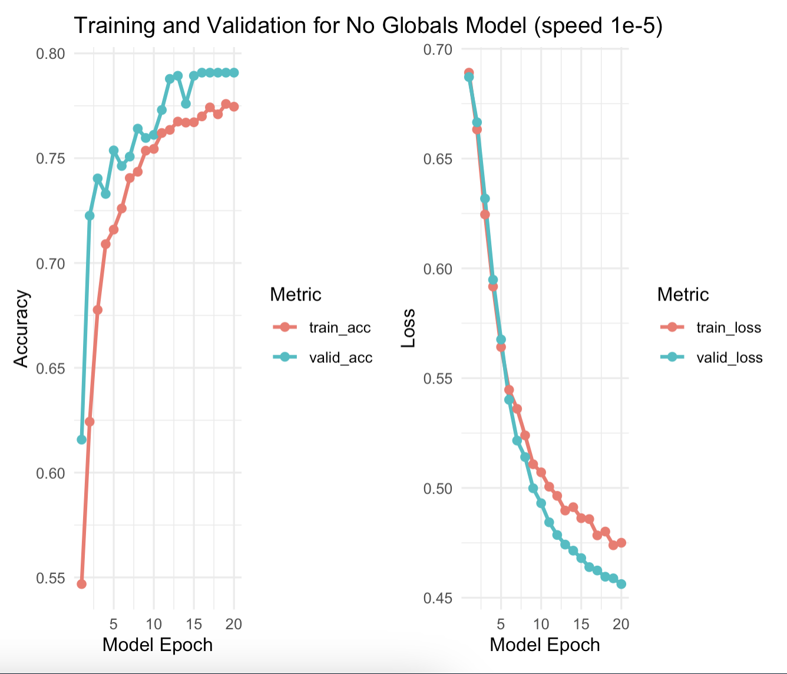 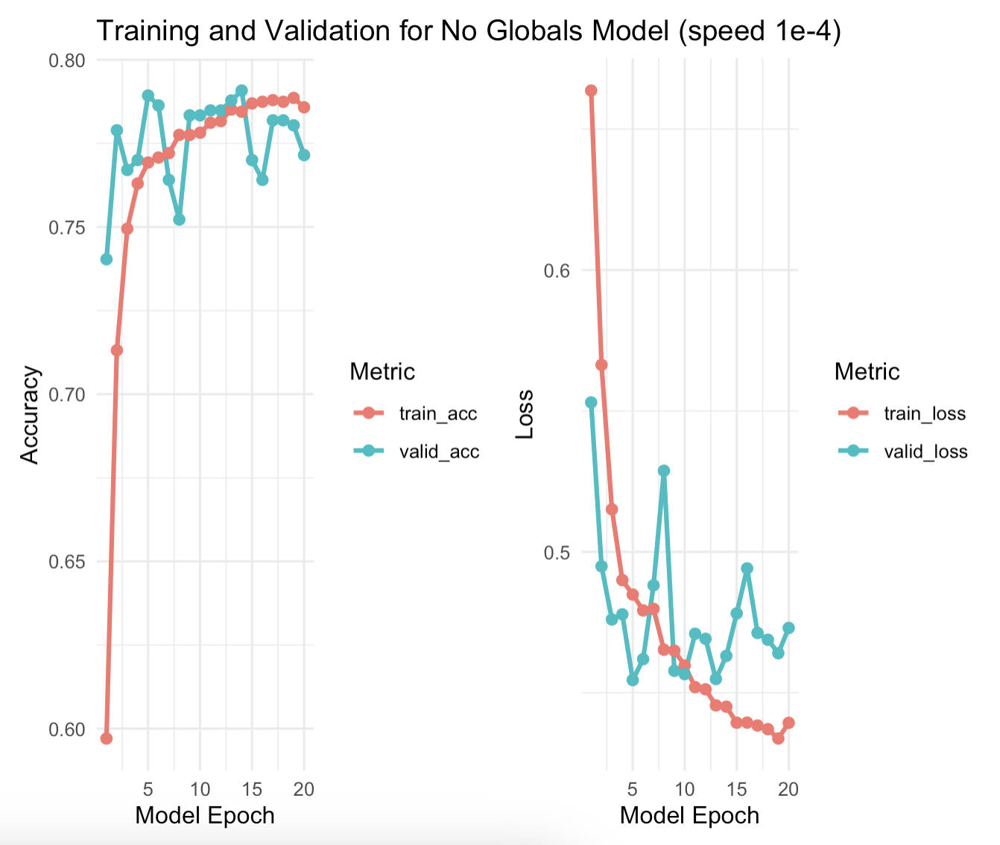 <br>
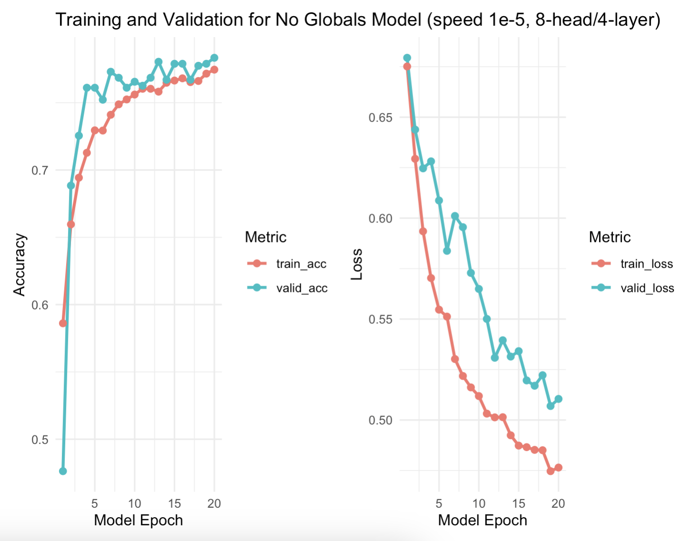 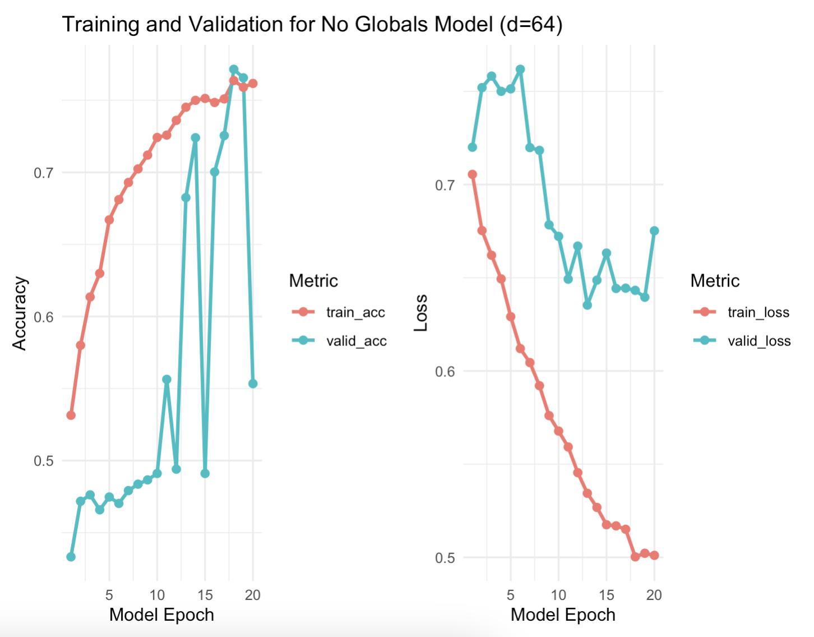 <br>
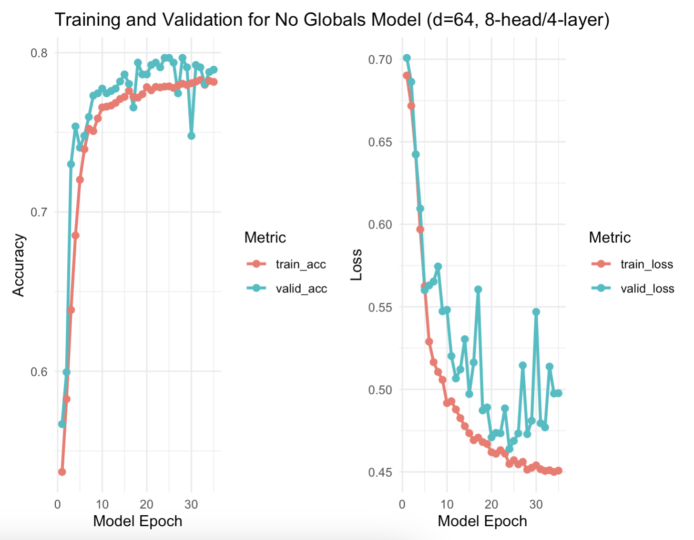 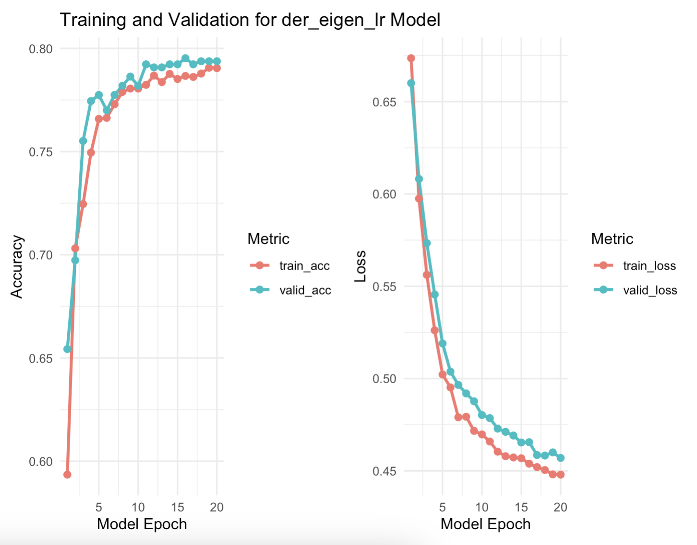 <br>
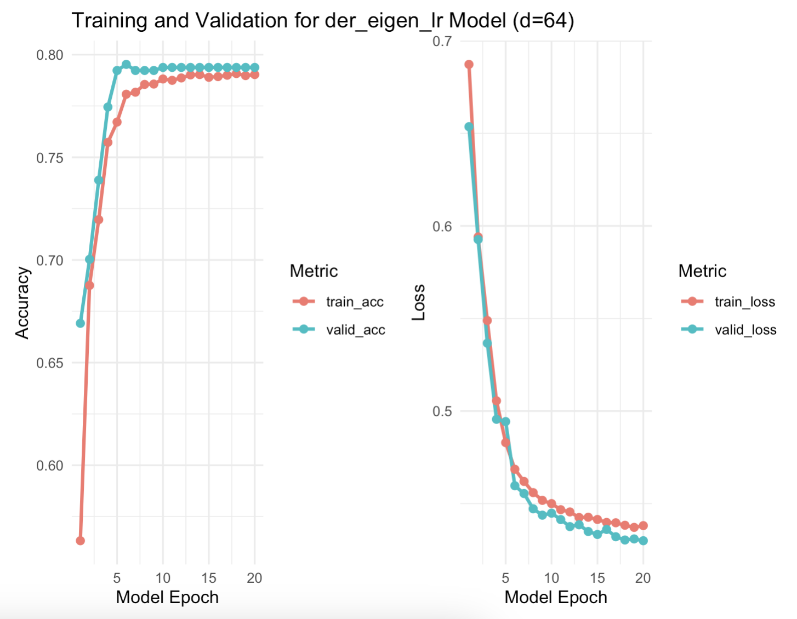 <br>

*Figures 12 ~ 18. Training and validation curves for selected models.* <br>

Note that the uncharacteristically low value for the “no_globals” 64-dimensional larger model is a result of model instability rather than consistently low results. Otherwise, though the transformer consistently outperformed the logistic regression control across a wide range of selected hyperparameters and ablated features, overfitting may be intuited from some of the selected graphs. It is unusual that a model perform better on a validation set than a training set, or for validation accuracy values to plateau as immediately as observed in [Fig. 17]. Though we had initially concluded the model must have simply reached the empirical maximum for what our features offer, the subsequent failure of our models on a validation set forced us to reconsider.

## Prediction Performance on the Test Sets
The full model [Fig. 21] and derivative-eigenvalue-L/R model [Fig. 22] were selected for evaluation on test sets randomly drawn from sessions 1 and 18 of the dataset. Accuracy outputs are displayed below.

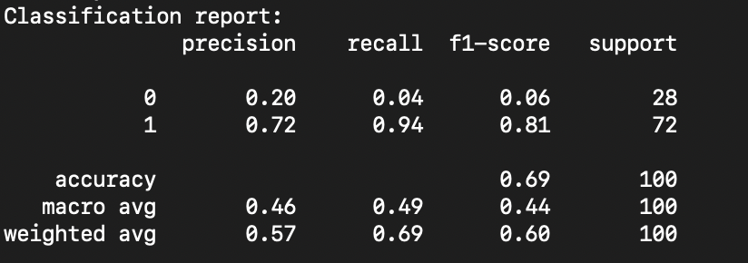  <br>

*Fig. 21, 22. Validation1 (accuracy=0.69) and Validation2 (accuracy=0.72) accuracy results for full model.* <br>

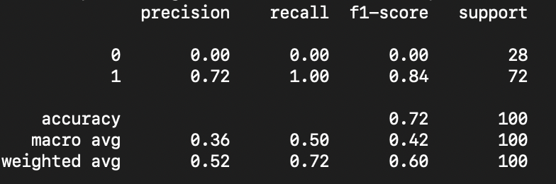 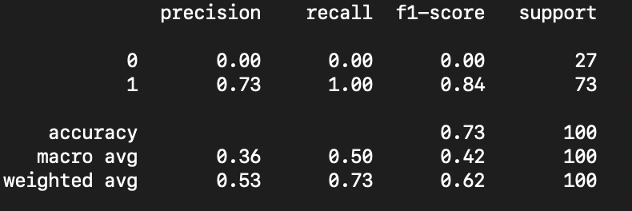 <br>

*Fig. 23, 24. Validation1 (accuracy=and Validation2 accuracy results for der-eig-L/R model.* <br>

Unfortunately, it is clear from validation trials that both models are highly ineffective at predicting real structure in neural data. Though all validation sets were predicted with an overall accuracy of 69% or higher, 3/4 trials demonstrated a 0% accuracy in predicting any trials as having a classification of unsuccessful mouse feedback (0). Only the full model was able to classify any as unsuccessful, though it is clear the model did not generalize across both validation sets. This evidences that the model simply learned to guess that a dataset is successful, becoming trapped in the local minima of the >50% chance than any trial in the neural dataset results in unsuccessful mouse feedback. This implies our equalization scheme for training data did not result in successful balancing of the data. <br>
To confirm, we went back and trained new models on an alternative balanced dataset: one with sufficient successful-feedback trials removed to match the number of unsuccessful-feedback trials, rather than adjusting the number of unsuccessful trials upwards through synthetic data. The results are telling: on the newly balanced dataset, our models completely failed to train past a random chance [Fig. 25, 26].

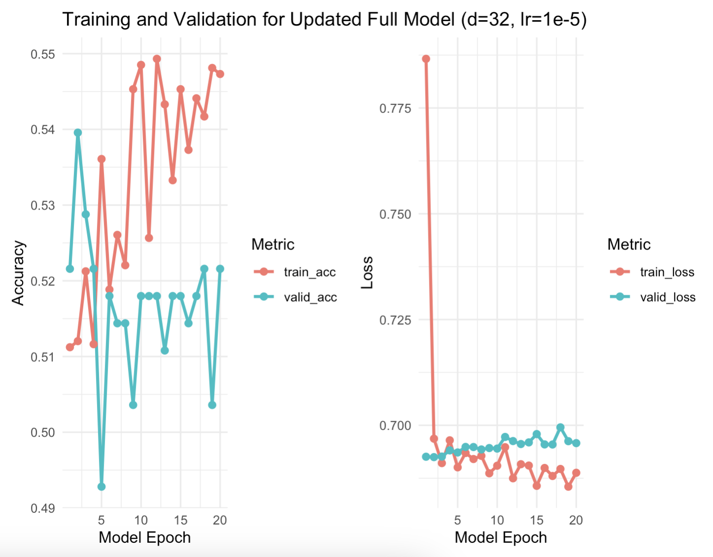  <br>

*Fig. 25, 26. Training and validation curves for properly-balanced full model.*

## Discussion
Within our feature data, our transformer models consistently outperformed a logistic regression of the principal components of our feature data, reaching a peak classification accuracy of just over 79% on validation data. By contrast, the logistic regression ranged from 72% to 76% depending on the features present. Visualizations of training epochs demonstrated no clear overfitting to training subsets of the feature set, with validation subsets seeing prediction accuracy on par with or marginally exceeding training sets despite often heightened variability. This implies that sequence-based methods did capture a nontrivial and generalizable amount of variation in the data that is not interpretable to models that assume linear separability. <br>
While the inclusion of summary statistics led to an increase in the accuracy of the logistic regression (75.52% on the full model vs. 72.10% on the derivatives & left/right contrasts set), they led to a decrease or non-improvement in transformer prediction accuracy relative to simpler feature sets (incorporating only rolling-window interregional eigenvalues, rolling-window derivatives). This suggests that the summary statistics primarily capture static or low-dimensional structure; in fact, they may act as only noise for the high-dimensional signals a transformer is designed to rely on. <br>
Despite the marginal increase in accuracy, the high accuracy of a logistic regression on our feature dataset paired with the hyperparameter-irrespective plateau in accuracy increases for our transformer ultimately suggest that our balancing pipeline for the data was fatally assumptive, in that it remained strongly biased to one class over another. This highlights the need for careful consideration of multiple types of overfitting in a dataset. In addition, it is likely our feature mining excessively reduced the dimensionality of Steinmetz’s data, ablating nuanced temporal trends that the transformer was intended to capture. Of particular note is the near-total redundancy between interregional eigenvalues and rolling-window derivatives, which produced only marginal increases in prediction accuracy when paired together relative to models trained separately on them (79.38% together vs. 79.23% for derivatives with left/right contrasts, 79.08% for eigenvalues with left/right contrasts). This implies that, despite the theoretically distinct reasoning between incorporating these two values, the reduction in dimensionality necessary to generalize them across sessions removed most unique temporal information. Within this feature and modeling architecture, it is unknowable whether this is because they encode the same information or if the reduction in dimensionality masks their unique contributions to high-dimensional signals; in place of interpreting these, our models became trapped in the local minima of guessing feedback is positive each time, as this remained a strong signal with an insufficiently rigorous balancing scheme. <br>
Additionally, based on tested hyperparameters, this feature data does not linearly benefit from higher-parameter models. Though some models (“no_globals” with d=32) benefited from an increase in model dimensionality and higher numbers of attention heads and transformer layers, others saw no increase at all (“der_eigen_lr”) or even decreased (“no_globals” with d=64). This suggests that the transformer architecture is struggling to find deeper patterns in the data, reinforcing the insufficient dimensionality of our mined features and improper balancing scheme. <br>
In summary, though the increases demonstrated by transformer application do point to some potential of their application in carefully-designed studies, this experiment and feature selection scheme cannot prove the suitability of transformers for Neuropixels data. This is ultimately a lesson in correct feature selection and balancing. Our transformer’s gains in predictive accuracy, while consistent on our training set, would not justify its use on account of a severe lack of generalizability. Our results suggest that all of our models severely suffer from overfitting, despite occasionally displaying interesting characteristics and marginal edges over a competitor model. <br>
Future work may include alternative balancing schemes and feature mining strategies that better preserve high-dimensional data. One potential strategy could be to determine the smallest number of neurons per session and randomly eliminate neurons from other sessions until all neural data is matching in size; this could provide a transformer with sufficiently high-dimensional data to learn deeper patterns from. An implementation for this approach is included in our code on account of it being a promising next step, though we personally lack the sufficient time and compute to utilize the resulting >4GB datasets. Alternatively, investment into bench work that involves more standardized data than Neuropixels can offer may be valuable if specifically assessing the utility of transformers in neurobiology. It may be the case that the type of data generated by Neuropixels inherently lends itself to less complex models with better interpretability, such as random forests or a simpler neural network. <br>

## Citations
**Publications**
**[1]** Steinmetz, N.A., Zatka-Haas, P., Carandini, M. et al. Distributed coding of choice, action and engagement across the mouse brain. Nature 576, 266–273 (2019). https://doi.org/10.1038/s41586-019-1787-x <br>
**[2]** Madan, S., Lentzen, M., Brandt, J. et al. Transformer models in biomedicine. BMC Med Inform Decis Mak 24, 214 (2024). https://doi.org/10.1186/s12911-024-02600-5 <br>
**[3]** Vaswani, Ashish, Noam Shazeer, Niki Parmar, Jakob Uszkoreit, Llion Jones, Aidan N Gomez, Ł ukasz Kaiser, and Illia Polosukhin. “Attention Is All You Need.” In Advances in Neural Information Processing Systems, edited by I. Guyon, U. Von Luxburg, S. Bengio, H. Wallach, R. Fergus, S. Vishwanathan, and R. Garnett, Vol. 30. Curran Associates, Inc., 2017. https://proceedings.neurips.cc/paper_files/paper/2017/file/3f5ee243547dee91fbd053c1c4a845aa-Paper.pdf. <br>
**[5]** Turner, Richard E. “An Introduction to Transformers.” arXiv, February 8, 2024. https://doi.org/10.48550/arXiv.2304.10557.<br>
**[6]** https://medium.com/@hunter-j-phillips/positional-encoding-7a93db4109e6

**Programming Help:**
**[4]** https://www.rdocumentation.org <br>
**[7]** https://github.com/ChenShizhe/StatDataScience <br>
**[8]** https://chatgpt.com/share/67d89db9-76fc-800c-bcb3-0738e467f880 <br>
**[9]** https://pytorch.org/docs/stable/index.html <br>


## Code Appendix
### EDA
(1) eda_session11.R
```r
library(tidyverse)
library(dplyr)

# First step: Understanding data's basic structure

session5 <- readRDS("../Data/session5.rds")
session5.spks11 <- session5$spks[[11]]
session5.time11 <- session5$time[[11]]

cat("Session 5 variables:", names(session5), "\n")
cat("Session 5 num. trials:", length(session5$feedback_type), "\n")

cat("Session 5, 11th trial\n")
cat("Mouse name:", session5$mouse_name, "\n")
cat("Feedback (outcomes):", session5$feedback_type[[11]], "\n")
cat("Contrast left:", session5$contrast_left[[11]], "\n")
cat("Contrast right:", session5$contrast_right[[11]], "\n")
cat("Brain area:", session5$brain_area[[11]], "\n")

cat("Spikes dimensionality:", dim(session5.spks11), "\n")
cat("Time length:", length(session5.time11), "\n")
cat("Brain area length:", (length(session5$brain_area)), "\n\n")

# Spikes are time-indexed
for (i in 1:10) {
  cat("Time ", i, ": ", session5.time11[[i]], '\n', sep="")
  cat("Spikes: ", session5.spks11[[i]], '\n', sep="")
}
```

(2) eda_structure.R
```r
library(tidyverse)
library(dplyr)
library(ggplot2)
library(purrr)


# Objective:
# describe the data structures across sessions 
# (e.g., number of neurons, number of trials, stimuli conditions, 
# feedback types) 

# 1. Distributions of number of neurons and number of trials.
make.neuron_trial_charts <- function(neuron.data, trial.data, 
                                     neural.title, trial.title) {
  neuron.chart <- ggplot(
    aes(x=neurons, fill=as.factor(mouse.name)), data=neuron.data) +
    geom_histogram(bins=30, position="stack") +
    labs(
      title=neural.title,
      x="Number (neurons)",
      y="Frequency",
      fill="Mouse ID"
    ) +
    theme_minimal()
  print(neuron.chart)
  
  trial.chart <- ggplot(
    aes(x=trials, fill=as.factor(mouse.name)), data=trial.data) +
    geom_histogram(bins=30, position="stack") +
    labs(
      title=trial.title,
      x="Number (trials)",
      y="Frequency",
      fill="Mouse ID"
    ) +
    theme_minimal()
  print(trial.chart)
}

neuron.data <- data.frame()
trial.data <- data.frame()
for (i in 1:18) {
  session <- readRDS(paste("../Data/session", i, ".rds", sep=""))
  
  neuron_count <- sum(sapply(session$spks, length))
  neuron_avg <- neuron_count / length(session$spks)
    neuron_count <- sum(sapply(session$spks, length))
  neuron_avg <- neuron_count / length(session$spks)
  
  neuron.data <- rbind(neuron.data, data.frame(
    neurons = neuron_avg,
    mouse.name = session$mouse_name
  ))
  trial.data <- rbind(trial.data, data.frame(
    trials = length(session$feedback_type),
    mouse.name = session$mouse_name
  ))
}

make.neuron_trial_charts(neuron.data, trial.data,
                         "Neuron Count by Session",
                         "Trial Count by Session")


# 2. Frequencies of permutations of L/R combinations, along with their 
#    success rates
contrast.data <- data.frame()
for (i in 1:18) {
  session <- readRDS(paste("../Data/session", i, ".rds", sep=""))
  
  session.contrasts <- data.frame(
    contrast.left = unlist(session$contrast_left),
    contrast.right = unlist(session$contrast_right),
    feedback.type = unlist(session$feedback_type)
  )
  contrast.data <- rbind(contrast.data, session.contrasts)
}

contrast.freq <- contrast.data %>%
  count(contrast.left, contrast.right) %>%
  arrange(desc(n))

contrast.plot <- ggplot(data=contrast.freq, aes(x=interaction(contrast.left, 
                                                              contrast.right, 
                                                              sep="; "), y=n)) +
                 geom_bar(stat="identity", fill="steelblue") +
                 labs(
                   title="Frequency of Contrast Left-Right Pairs",
                   x="Contrast (Left; Right)",
                   y="Frequency"
                 ) +
                 theme_minimal() +
                 theme(axis.text.x = element_text(angle=45, hjust=1))
print(contrast.plot)

contrast.feedback <- contrast.data %>%
  group_by(contrast.left, contrast.right) %>%
  summarize(
    success_rate = sum(feedback.type == 1) / length(feedback.type),
    .groups="drop"
  ) %>%
  mutate(contrast.pair=interaction(contrast.left, contrast.right, sep="; ")) %>% 
  arrange(success_rate) %>%
  mutate(contrast.pair = factor(contrast.pair, levels=contrast.pair))

contrast.feedback.plot <- ggplot(data=contrast.feedback, aes(x=contrast.pair, 
                                                             y=success_rate)) +
                          geom_bar(stat="identity", fill="steelblue") +
                          labs(
                            title="Success rate by Contrast Left-Right Pair",
                            x="Contrast (Left; Right)",
                            y="Success rate (# correct / total)"
                          ) +
                          theme_minimal() +
                          theme(axis.text.x = element_text(angle=45, hjust = 1))
print(contrast.feedback.plot)


# (2) figure out which brain regions are conserved across regions, if any
sessions <- list()
for (i in 1:18) {
  sessions[[i]] <- readRDS(paste("../Data/session", i, ".rds", sep='')) 
  print(sessions[[i]]$mouse_name)
}

# find all unique regions
all_regions <- lapply(sessions, function(s) {
  s$brain_area %>% unique()
}) %>%
  unlist() %>%
  unique()

# print conserved regions
conserved_regions <- Reduce(intersect, lapply(sessions, function(s) s$brain_area))
#print(conserved_regions) # none

# print brain regions by session
lapply(sessions, function(s) s$brain_area %>% unique()) #%>% print())

# print minimum # brain regions (important to know for PCA analysis)
lapply(sessions, function(s) s$brain_area %>% unique() %>% length()) %>% 
  unlist() %>% min() #%>% print()

session1 <- sessions[[1]]
print(session1$brain_area[[1]])

# (3) Miscellaneous basic information
# Time range
session5 <- sessions[[i]]
session5.t <- session5$time[[11]]
lapply(seq_along(this.session$time), function(i) {
  session5.t <- session5$time[[i]]
  print(max(session5.t) - min(session5.t))
})
```

(3) eda_pca_exploration.R
```r
library(dplyr)
library(tidyverse)
library(ggplot2)
library(gridExtra)
library(tsne)

# Is data separable by PCA based on inputs?
# Short answer: no

session5 <- readRDS("../Data/session5.rds")

session5.spks_df <- lapply(seq_along(session5$spks), function(i) {
  as.data.frame(session5$spks[[i]]) %>%
    mutate(NeuronID = row_number(), 
           Trial = i,
           contrast.left = session5$contrast_left[i],
           contrast.right = session5$contrast_right[i])
})

# Inputs: mouse (accounted for by selecting only session5)
#         L/R contrast; all permutations

session5.cl <- session5$contrast_left %>% unique()
session5.cr <- session5$contrast_right %>% unique()
session.contrasts <- expand.grid(
  contrast.left = session5.cl,
  contrast.right = session5.cr
) %>% arrange(desc(contrast.right))
# session.contrasts now holds all 16 permutations of L/R inputs

session5.lrs = list()
for (i in 1:16) {
  l <- session.contrasts$contrast.left[[i]]
  r <- session.contrasts$contrast.right[[i]]
  
  session5.filter <- session5.spks_df %>%
                     bind_rows() %>%
                     filter(contrast.left == l & contrast.right == r)
  
  session5.lrs[[paste0("L", l, "_R", r)]] <- session5.filter
}
# session5.lrs now holds all L/R permutation-associated data

session5.pcas = list()
for (i in 1:16) {
  session5.combined <- session5.lrs[[i]] %>%
                       select(-NeuronID, -Trial, -contrast.left, -contrast.right) %>%
                       as.matrix()
  
  pca <- prcomp(session5.combined)
  pca.df <- data.frame(PC1=pca$x[,1], PC2=pca$x[,2]) 

  l <- unique(session5.lrs[[i]]$contrast.left)
  r <- unique(session5.lrs[[i]]$contrast.right)
  lr <- paste0("L", l, "_R", r)
  pca.title <- paste0("PCA for L=", l, ", R=", r)
  
  pca.plot <- ggplot(pca.df, aes(x=PC1, y=PC2)) +
              geom_point(alpha=0.7) +
              labs(
                title=pca.title,
                x="PC1",
                y="PC2"
              ) +
              theme_minimal()
  
  session5.pcas[[lr]] <- pca.plot
}

#session5.plots <- split(session5.pcas, ceiling(seq_along(session5.pcas) / 4))
#for (i in 1:4) {
#  do.call(grid.arrange, c(session5.plots[[i]], ncol=2))
#}


# (3) Is data separable by a nonlinear method, given PCA's failure?
# Try: tsne

session5.tsne <- tsne(session5.lrs[["L1_R0"]], initial_dims=2)
session5.tsne <- data.frame(session5.tsne)

print(summary(session5.tsne))
```

(4) eda_pca_output.R
```r
# EDA, interest 1: Is data separable by PCA based on outputs?

# First: we need a way to visualize neural response.
# Easy way: proportion of neurons active. this may ablate important information 
# though
# Potentially better way: PCA between sessions of interest. Dimensionality 
# reduction from session x neuron x time to principal components


# A case study (for learning)
session5 <- readRDS("../Data/session5.rds")
trial1 <- as.data.frame(session5$spks[[11]]) %>%
  mutate(NeuronID = row_number())
trial2 <- as.data.frame(session5$spks[[12]]) %>%
  mutate(NeuronID = row_number())
combined <- full_join(trial1, trial2, by="NeuronID") %>%
  select(-NeuronID) %>%
  as.matrix

pca <- prcomp(combined, center=TRUE, scale.=TRUE)
print(summary(pca))

pca.df <- data.frame(PC1=pca$x[,1], PC2=pca$x[,2])
pca.plot <- ggplot(pca.df, aes(x=PC1, y=PC2)) +
  geom_point(alpha=0.7) +
  theme_minimal() +
  labs(
    title="PCA of Neural Activity Across Trials 11 & 12 of Session 5",
    x="PC1",
    y="PC2"
  )
#print(pca.plot)


# ===== TRY EXTENDING TO AN ENTIRE SESSION ===== #

session5.df <- lapply(seq_along(session5$spks), function(i) {
  as.data.frame(session5$spks[[i]]) %>%
    mutate(NeuronID=row_number(), Trial=i)
})
session5.ft <- session5$feedback_type
session5.ft.y <- which(session5.ft == 1)
session5.ft.n <- which(session5.ft == -1)

session5.df.y <- session5.df[session5.ft.y]
session5.df.n <- session5.df[session5.ft.n]

session5.combined.y <- Reduce(function(x,y) full_join(x, y, by="NeuronID"), session5.df.y) %>%
  select(-NeuronID) %>%
  as.matrix()

session5.combined.n <- Reduce(function(x,y) full_join(x, y, by="NeuronID"), session5.df.n) %>%
  select(-NeuronID) %>%
  as.matrix()

pca.y <- prcomp(session5.combined.y)
pca.y.df <- data.frame(PC1=pca.y$x[,1], PC2=pca.y$x[,2], Label="Yes")
var.y <- (pca.y$sdev^2) / sum(pca.y$sdev^2)
print(var.y[1:10])

pca.n <- prcomp(session5.combined.n)
pca.n.df <- data.frame(PC1=pca.n$x[,1], PC2=pca.n$x[,2], Label="No")
var.n <- (pca.n$sdev^2) / sum(pca.y$sdev^2)
print(var.n[1:10])

pca.yn.df <- rbind(pca.y.df, pca.n.df)

pca.y.plot <- ggplot(pca.y.df, aes(x=PC1, y=PC2)) +
  geom_point(alpha=0.7) +
  theme_minimal() +
  labs(
    title="PCA of Neural Activity Across Successful Mouse Decisions",
    x="PC1",
    y="PC2"
  )
print(pca.y.plot)

pca.n.plot <- ggplot(pca.n.df, aes(x=PC1, y=PC2)) +
  geom_point(alpha=0.7) +
  theme_minimal() +
  labs(
    title="PCA of Neural Activity Across Unsuccessful Mouse Decisions",
    x="PC1",
    y="PC2"
  )
print(pca.n.plot)

pca.yn.plot <- ggplot(pca.yn.df, aes(x=PC1, y=PC2, color=Label)) +
  geom_point(alpha=0.7) +
  theme_minimal() +
  labs(
    title="Neural Activity PCA Across Yes/No Decisions (Session 5)",
    x="PC1",
    y="PC2"
  )
print(pca.yn.plot)
```

(5) eda_temporal.R
```r
library(ggplot2)

# Load sessions
session5 <- readRDS("../Data/session5.rds")
session5.11 <- session5$spks[[11]]

# Calculate autocorrelations for trial 11 of session 5 as an experiment
acfs <- sapply(1:nrow(session5.11), function(n) {
        acf(session5.11[n,], lag.max=100, plot=FALSE)$acf
})
avg.acf <- rowMeans(acfs, na.rm=TRUE)
lags <- acf(session5.11[1,], lag.max=100, plot=FALSE)$lag
  
# Compute autocorrelation
acf.df <- data.frame(lag = lags, acf = avg.acf)
acf.df <- na.omit(acf.df)

# Plot autocorrelation
acf.plot <- ggplot(acf.df, aes(x = lag, y = acf)) +
            geom_line() +
            geom_point() +
            labs(
              title = "Autocorrelation for Session 5, Trial 11",
              x = "Lag (time steps)", 
              y = "Autocorrelation") +
            theme_minimal()
print(acf.plot)

# No clear temporal relationship between random neurons. OK, somewhat expected
# Let's try brain regions.

# Find all unique brain regions in session 5:
session5.regions <- unique(session5$brain_area)

session5.regional <- lapply(session5.regions, function(region) {
  neurons <- which(session5$brain_area == region)
  rowMeans(session5$spks[[11]][neurons, , drop=FALSE])
})

session5.region_matrix <- do.call(rbind, session5.regional)
rownames(session5.region_matrix) <- session5.regions

session5.11.r_acfs <- lapply(session5.regions, function(region) {
  my.acf <- acf(session5.region_matrix[region, ], lag.max=100, plot=FALSE)
  data.frame(lag = my.acf$lag, 
             acf = as.vector(my.acf$acf), 
             region=region)
})

# Find all autocorrelations by brain region in session 5, trial 11:
acf.df <- do.call(rbind, session5.11.r_acfs)
acf.df <- acf.df %>% # smooth it
          group_by(region) %>%
          mutate(acf.smooth = zoo::rollmean(acf, k=5, fill=NA, align="center", partial=TRUE))

acf.plot <- ggplot(acf.df, aes(x=lag, y=acf.smooth, color=region)) +
            geom_line(na.rm=TRUE) +
            geom_point(na.rm=TRUE) +
            labs(
              title="Autocorrelation by Brain Region",
              x="Lag (time steps)",
              y="Autocorrelation"
            ) +
            theme_minimal()
print(acf.plot)

# Quantify memory of brain regions
session5.memory <- acf.df %>%
  group_by(region) %>%
  summarize(acf.mean = mean(abs(acf)))

print(session5.memory)


# Q1: differentiability between feedback={-1,1} and L/R permutations based 
#     on this?

# Select relevant data from session 5
session5.df <- lapply(seq_along(session5$spks), function(i) {
  as.data.frame(session5$spks[[i]]) %>%
    mutate(
      NeuronID = row_number(),
      contrast.left = session5$contrast_left[i],
      contrast.right = session5$contrast_right[i],
      feedback = session5$feedback_type[i],
      region = session5$brain_area
    )
}) %>% bind_rows()

# Find unique brain areas, regions
session5$brain_area %>% unique() %>% print()
session5.df$region %>% unique() %>% print()

# Identify all permutations of unique contrast levels
session5.cl <- session5$contrast_left %>% unique()
session5.cr <- session5$contrast_right %>% unique()
session5.contrasts <- expand.grid(
  contrast.left = session5.cl,
  contrast.right = session5.cr
) %>% arrange(desc(contrast.right))

# Generate L/R permutation subsets
session5.lrs <- list()
for (i in 1:nrow(session5.contrasts)) {
  l <- session5.contrasts$contrast.left[[i]]
  r <- session5.contrasts$contrast.right[[i]]
  
  session5.filter <- session5.df %>%
                     filter(contrast.left == l & contrast.right == r)
  
  session5.lrs[[paste0("L", l, "_R", r)]] <- session5.filter
}

session5.df.y <- session5.df %>% 
                 filter(feedback == 1) # generate feedback=y subset
session5.df.n <- session5.df %>% 
                 filter(feedback == -1) # generate feedback=n subset


# Grab brain regions by feedback = -1/1
session5.y.regions <- unique(session5.df.y$region)
session5.n.regions <- unique(session5.df.n$region)

session5.y.regional <- lapply(session5.y.regions, function(reg) {
  neurons <- which(session5.df.y$region == reg)
})
session5.n.regional <- lapply(session5.n.regions, function(reg) {
  neurons <- which(session5.df.n$region == reg)
})


# Function to compute an average timeseries by region
compute.region_timeseries <- function(df, region.name) {
  region.df <- df %>% filter(region == region.name)   
  
  region.df.times <- region.df %>%
                     select(-NeuronID, -region, -feedback, -contrast.left, -contrast.right)
  
  if (nrow(region.df.times) == 0) {
    return(NULL)
  }
  return( colMeans(region.df.times, na.rm=TRUE) )
}


# Function to compute autocorrelations from average region timeseries
compute.acf <- function(region.vector, max_lag=100) {
  if (is.null(region.vector)) {
    return(NULL)
  }
  my.acf <- acf(region.vector, lag.max=max_lag, plot=FALSE)
  data.frame(
    lag = my.acf$lag,
    acf = my.acf$acf
  )
}


# Compute autocorrelates for feedback=1 trials
session5.y.acfs <- lapply(unique(session5.df.y$region), function(reg) {
  region.vector <- compute.region_timeseries(session5.df.y, reg)
  acf.df <- compute.acf(region.vector)
  
  if (!is.null(acf.df)) {
    acf.df$region <- reg
    acf.df$feedback <- 'y'
  }
  return(acf.df)
})
session5.y.acfs <- session5.y.acfs[!sapply(session5.y.acfs, is.null)]
session5.y.acfs.df <- bind_rows(session5.y.acfs)


# Compute autocorrelates for feedback=-1 trials
session5.n.acfs <- lapply(unique(session5.df.n$region), function(reg) {
  region.vector <- compute.region_timeseries(session5.df.n, reg)
  acf.df <- compute.acf(region.vector)
  
  if (!is.null(acf.df)) {
    acf.df$region <- reg
    acf.df$feedback <- 'n'
  }
  return(acf.df)
})
session5.n.acfs <- session5.n.acfs[!sapply(session5.n.acfs, is.null)]
session5.n.acfs.df <- bind_rows(session5.n.acfs)


# Combine all and plot to see any regional differences
session5.yn.acfs.df <- bind_rows(session5.y.acfs.df, session5.n.acfs.df)

session5.yn.plot <- ggplot(session5.yn.acfs.df, aes(x=lag, y=acf, color=feedback)) +
                    geom_line(na.rm=TRUE) +
                    facet_wrap(~ region, scales="free_y") +
                    labs(
                      title="Region-wise Autocorrelation by Feedback",
                      x="Lag (time steps)",
                      y="Autocorrelation"
                    ) +
                    theme_minimal()
print(session5.yn.plot)


# Q2: correlation between brain regions as a feature?
# Exploratory: plot one trial's region-wise autocorrelation correlations
acf.wide <- acf.df %>%
            select(lag, region, acf.smooth) %>%
            spread(key=region, value=acf.smooth)
acf.cor.matrix <- cor(acf.wide[,-1], use="pairwise.complete.obs")

acf.cor.long <- as.data.frame(as.table(acf.cor.matrix)) %>%
                arrange(desc(abs(Freq)))
acf.cor.plot <- ggplot(acf.cor.long, aes(Var1, Var2, fill=Freq)) +
                geom_tile() +
                scale_fill_gradient2(low="blue", high="red", mid="white", midpoint=0) +
                theme_minimal() +
                labs(
                  title="Region-wise Autocorrelation Correlations (Session 5.11)",
                  x="Region",
                  y="Region"
                )
print(acf.cor.plot)


# Identify feedback=1, feedback=-1 matrices as for Q1 and plot accordingly
y.acf.wide <- session5.y.acfs.df %>%
              select(lag, region, acf) %>%
              spread(key=region, value=acf)
y.acf.cor.matrix <- cor(y.acf.wide[,-1], use="pairwise.complete.obs")

y.acf.cor.long <- as.data.frame(as.table(y.acf.cor.matrix)) %>%
                  arrange(desc(abs(Freq)))
y.acf.cor.plot <- ggplot(y.acf.cor.long, aes(Var1, Var2, fill=Freq)) +
                  geom_tile() +
                  scale_fill_gradient2(low="blue", high="red", mid="white", midpoint=0) +
                  theme_minimal() +
                  labs(
                    title="Region-wise Autocorrelation Correlations, Feedback=Y",
                    x="Region",
                    y="Region"
                  )
print(y.acf.cor.plot)


n.acf.wide <- session5.n.acfs.df %>%
              select(lag, region, acf) %>%
              spread(key=region, value=acf)
n.acf.cor.matrix <- cor(n.acf.wide[,-1], use="pairwise.complete.obs")

n.acf.cor.long <- as.data.frame(as.table(n.acf.cor.matrix)) %>%
                  arrange(desc(abs(Freq)))
n.acf.cor.plot <- ggplot(n.acf.cor.long, aes(Var1, Var2, fill=Freq)) +
                  geom_tile() +
                  scale_fill_gradient2(low="blue", high="red", mid="white", midpoint=0) +
                  theme_minimal() +
                  labs(
                    title="Region-wise Autocorrelation Correlations, Feedback=N",
                    x="Region",
                    y="Region"
                  )
print(n.acf.cor.plot)
```

### Integration
(1) restructuring.R
```r
library(dplyr)
library(tidyverse)


# Objective: to have a data structure that is anything other than 4 levels of 
#            lists


# Original data structure:
# "sessions" is a list of sessions.
# each session is a list of trials. It has metadata: the mouse name and 
# experiment date.
# each trial is a list of variables about the trial. It has metadata: the L/R 
# contrast and feedback and...
# - a list of vectors 1:40 that encode the states of every k neurons
# - a list of timepoints 1:40
# - a list of k brain areas for each neuron

# Restructuring (escaping base R...):
# Every trial should be a k x 40 tibble, with k neurons on the rows and 40 
# columns.
# It can also include the brain areas, feedback_type, and L/R contrast into 
# the first columns.
# Then, every session can be a list of these dataframes.


# session_to_tibbles()
# @param: session; neural data loaded from .rds files under Data
# @returns: a list of tibbles encoding the information of each trial in the 
#          session
session_to_tibbles <- function(session) {
  trials <- lapply(seq_along(session$spks), function(i) {
    t <- tibble(
      neuron_id = seq_len(nrow(session$spks[[i]])),
      region = session$brain_area,
      feedback = session$feedback_type[[i]],
      contrast_left = session$contrast_left[[i]],
      contrast_right = session$contrast_right[[i]],
      mouse_name = session$mouse_name,
      as_tibble(session$spks[[i]])
    )
    
    return(t)
  })
  
  trials <- lapply(trials, function(trial) {
    colnames(trial)[7:46] <- paste0('t', 1:40)
    return(trial)
  })
  
  return(trials)
}

# load_sessions()
# @param: n/a
# @returns: list of sessions loaded from .rds files in Data, converted to lists
#          of tibbles
load_sessions <- function() {
  sessions <- list()
  for (i in 1:18) {
    sessions[[i]] <- readRDS(paste("../Data/session", i, ".rds", sep=""))
  }
  
  # Explicitly remove session 1 & 18 because they are used for validation data
  sessions <- sessions[-c(1,18)]
  
  sessions <- lapply(sessions, function(s) session_to_tibbles(s))
  return(sessions)
}

# load_validation_sessions()
# @param: n/a
# @returns: list with test data 1, 2
load_validation_sessions <- function() {
  sessions <- list()
  sessions[[1]] <- readRDS("../Data/test1.rds")
  sessions[[2]] <- readRDS("../Data/test2.rds")
  sessions <- lapply(sessions, function(s) session_to_tibbles(s))
  return(sessions)
}
  
# load_unified_sessions()
# @param: n/a
# @returns: a single list of all trials from all sessions as tibbles
load_unified_sessions <- function() {
  sessions <- load_sessions()
  unified <- unlist(sessions, recursive=FALSE)
  return(unified)
}

# print_yn_counts(trials)
# @param: trials; list of trials (as tibbles) of interest
# @returns: n/a
print_yn_counts <- function(trials) {
  keep(trials, ~ .x$feedback[[1]] == 1) %>% length() %>% print()
  keep(trials, ~ .x$feedback[[1]] == -1) %>% length() %>% print()
}

# equalize_yn_trials(trials)
# @param: trials; list of trials (as tibbles) of interest
# @returns: trials list augmented with 2x more "n" trials, injected with
#           random noise
equalize_yn_trials <- function(trials) { # need ~2x more "n" trials
  
  # This is the (wrong) equalization used in all my models. Please see
  # commented-out section below for alternative solution.
  trials.n <- keep(trials, ~ .x$feedback[[1]] == -1) 
  trials.y <- keep(trials, ~ .x$feedback[[1]] == 1)

  trials.n.addtl <- length(trials.y) - length(trials.n)
  
  noise <- 0.08
  times <- paste0("t", 1:40)
  
  trials.n.addtl <- lapply(trials.n.addtl, function(t) {
    t <- t %>% 
      mutate(across(all_of(times), ~ ifelse(runif(n()) < noise, 1 - ., .)))
    return(t)
  })
  
  trials.n.aug <- c(trials.n, trials.n.addtl)
  trials <- c(trials.y, trials.n.aug)
   
  # Alternative solution that resulted in "true" model training (or lack
  # thereof)
  #trials.y <- trials.y %>% sample(size=length(trials.n))
  
  #trials <- c(trials.y, trials.n)
  #trials <- sample(trials) # shuffle
  #return(trials)
}

# gen_train_val_sets(trials, train_or_val)
# @param: trials; list of trials (as tibbles) of interest
#         train_or_val=1 returns training data;
#         train_or_val=2 returns validation data;
# @returns: separated training or validation data
gen_train_val_sets <- function(trials, train_or_val=1) {
  trials.n <- keep(trials, ~ .x$feedback[[1]] == -1)
  trials.y <- keep(trials, ~ .x$feedback[[1]] == 1)
  
  len.n <- length(trials.n)
  len.y <- length(trials.y)
  
  train.n.idx <- sample(seq_along(trials.n), size=floor(0.9 * len.n))
  train.n <- trials.n[train.n.idx]
  valid.n <- trials.n[-train.n.idx]
  
  train.y.idx <- sample(seq_along(trials.y), size=floor(0.9 * len.y))
  train.y <- trials.y[train.y.idx]
  valid.y <- trials.y[-train.y.idx]
  
  train <- c(train.y, train.n)
  valid <- c(valid.y, valid.n)
  
  train_valid = list(train, valid)
  return(train_valid)
}

# restructuring_test(): validation of trial augmentation procedure
# @param; n/a
# @returns; n/a
restructuring_test <- function() {
  set.seed(123)
  
  trials <- load_unified_sessions()
  print_yn_counts(trials)
  
  trials <- equalize_yn_trials(trials)
  print_yn_counts(trials)
  
  train <- gen_train_val_sets(trials, 1)
  valid <- gen_train_val_sets(trials, 2)
  print("yn_counts train:")
  print_yn_counts(train)
  print("yn_counts valid:")
  print_yn_counts(valid)
}  

#restructuring_test()
```

(2) integration.R
```r
library(dplyr)
library(tidyverse)
library(moments)
library(zoo)
library(robustbase)
library(reticulate)

source("./restructuring.R")


### ### ### ### ### ### ### ### ### ### ### ### ### ### ### ### ### ### ### ###
# My data architecture:                                                       #
#                                                                             #
# A k x 40 matrix, where...                                                   #
# - 40 features are a sine/cosine index preserving temporal structure;        #
# - k-40 features are handcrafted summary statistics;                         #
#                                                                             #
# Ablation studies can help learn the optimal value of x and the utility of   #
# every kth feature.                                                          #
#                                                                             #
### ### ### ### ### ### ### ### ### ### ### ### ### ### ### ### ### ### ### ###


# get_spks(trials)
# @param: trials; all trials (as tibbles) of interest
# @returns: all trials' spks data bound together into one tibble
get_spks <- function(trials) {
  trials.spks <- lapply(trials, function(t) t %>% select(t1:t40))
  trials.spks <- bind_rows(trials.spks)
  return(trials.spks)
}

# Positional encoding
#
# Source: https://medium.com/@hunter-j-phillips/positional-encoding-7a93db4109e6
# For each k = 0 to L - 1:
#   For each i = 0 to d_{model} / 2:
#     PE(k,2i) = sin(k/n ^ (2i / d_{model}))
#     PE(k,2i+1) = cos(k/n ^ /(2i / d_{model}))
#
# sine_cos_index(trials_len): generates sine-cos indices to preserve temporal
#                             information.
# @param: L; number of tokens, all models have 40 by default
#         d; number of features; variable per model
#         n; any constant, though literature recommends n=10,000
# @returns: sine-cos indices as an L x d tibble
get_pos_indices <- function(L=40, d, n=10000) {
  if (d %% 2 != 0) stop("d must be even")
 
  pos <- matrix(0, nrow=L, ncol=d)
  
  for (k in 1:L) {
    for (i in 1:(d/2)) {
      # formula corrected for R's 1-indexing
      pos[k, 2*i-1]  <- sin((k-1) / n ^ ((2 * i) / d))
      pos[k, 2*i] <- cos((k-1) / (n ^ (2 * i) / d))
    }
  }
  pos <- pos %>% 
         as_tibble() %>% 
         mutate(time = paste0('p', 1:40)) %>% 
         relocate(time)
  
  return(pos)
}

# get_means(trials, name)
# @param: trials; all trials (as tibbles) of interest
#         name; name of means column in returned tibble
# @returns: 40x2 tibble of timebin-indexed average activations
get_means <- function(trials, name="mean_overall") {
  trials.spks <- get_spks(trials)
  
  means <- colMeans(trials.spks)
  t <- enframe(means, name="time", value=name)
  return(t)
}

# get_medians(trials, name)
# @param: trials; all trials (as tibbles) of interest
#         name; name of medians column in returned tibble
# @returns: 40x2 tibble of timebin-indexed average activations
get_medians <- function(trials, name="median_overall") {
  trials.spks <- get_spks(trials)
  
  medians <- apply(trials.spks, 2, median)
  t <- enframe(medians, name="time", value=name)
  return(t)
}

# get_stdevs(trials, name)
# @param: trials; all trials (as tibbles) of interest
#         name; name of stdev column in returned tibble
# @returns: 40x2 tibble of timebin-indexed average activations
get_stdevs <- function(trials, name="sd_overall") {
  trials.spks <- get_spks(trials)
  
  sds <- apply(trials.spks, 2, sd)
  t <- enframe(sds, name="time", value=name)
  return(t)
}

# get_skewness(trials, name)
# @param: trials; all trials (as tibbles) of interest
#         name; name of skewness column in returned tibble
# @returns: 40x2 tibble of timebin-indexed activation skewness
get_skewness <- function(trials, name="skewness_overall") {
  trials.spks <- get_spks(trials)
  
  skew <- skewness(trials.spks)
  t <- enframe(skew, name="time", value=name)
  return(t)
}

# get_kurtosis(trials, name)
# @param: trials; all trials (as tibbles) of interest
#         name; name of kurtosis column in returned tibble
# @returns: 40x2 tibble of timebin-indexed activation kurtosis
get_kurtosis <- function(trials, name="kurtosis_overall") {
  trials.spks <- get_spks(trials)
  
  kurt <- kurtosis(trials.spks)
  t <- enframe(kurt, name="time", value=name)
  return(t)
}

# get_first_deriv(trials, name)
# @param: trials; all trials (as tibbles) of interest
#         name; name of first derivative column in returned tibble
# @returns: 40x2 tibble of timebin-indexed activation first derivatives
get_first_deriv <- function(trials, name="first_derivative") {
  trials.spks <- get_spks(trials)
  
  trials.1derivs <- t(apply(trials.spks, 1, diff))
  trials.avg.1derivs <- colMeans(trials.1derivs)
  trials.avg.1derivs <- c(0, trials.avg.1derivs)
  
  t <- enframe(trials.avg.1derivs, name="time", value=name)
  return(t)
}

# get_second_deriv(trials, name)
# @param: trials; all trials (as tibbles) of interest
#         name; name of second derivative column in returned tibble
# @returns: 40x2 tibble of timebin-indexed activation second derivatives
get_second_deriv <- function(trials, name="second_derivative") {
  trials.spks <- get_spks(trials)
  
  trials.2derivs <- t(apply(trials.spks, 1, function(x) {
    diff(diff(x))
  }))
  trials.avg.2derivs <- colMeans(trials.2derivs)
  trials.avg.2derivs <- c(0, 0, trials.avg.2derivs)
  
  t <- enframe(trials.avg.2derivs, name="time", value=name)
  return(t)
}

# get_rolling_mean(trials, window, name)
# @param: trials; all trials (as tibbles) of interest
#         window; size of window for rolling mean
#         name; name of rolling means column in returned tibble
# @returns: 40x2 tibble of timebin-indexed rolling activation means
get_rolling_mean <- function(trials, window=3, name="mean_rolling") {
  trials.spks <- get_spks(trials)
  
  means <- colMeans(trials.spks)
  rolling.means <- rollapply(means, width=window, 
                             FUN=mean, align="right", fill=0, partial=TRUE)
  t <- enframe(rolling.means, name="time", value=name)
  return(t)
}

# get_rolling_median(trials, window, name)
# @param: trials; all trials (as tibbles) of interest
#         window; size of window for rolling median
#         name; name of rolling means column in returned tibble
# @ returns: 40x2 tibble of timebin-indexed rolling activation medians
get_rolling_median <- function(trials, window=3, name="median_rolling") {
  trials.spks <- get_spks(trials)
  
  medians <- apply(trials.spks, 2, median)
  rolling.medians <- rollapply(medians, width=window,
                               FUN=mean, align="right", fill=0, partial=TRUE)
  t <- enframe(rolling.medians, name="time", value=name)
  return(t)
}

# get_rolling_sd(trials, window, name)
# @param: trials; all trials (as tibbles) of interest
#         window; size of window for rolling stdev
#         name; name of rolling stdev column in returned tibble
# @returns: 40x2 tibble of timebin-indexed rolling stdev means
get_rolling_sd <- function(trials, window=3, name="sd_rolling") {
  trials.spks <- get_spks(trials)
  sds <- apply(trials.spks, 2, sd)
  rolling.sds <- rollapply(sds, width=window, 
                           FUN=mean, align="right", fill=0)
  t <- enframe(rolling.sds, name="time", value=name)
  return(t)
  }

# get_rolling_skew(trials, window, name)
# @param: trials; all trials (as tibbles) of interest
#         window; size of window for rolling skewness
#         name; name of rolling skewness column in returned tibble
# @returns: 40x2 tibble of timebin-index rolling skewness means
get_rolling_skew <- function(trials, window=3, name="skew_rolling") {
  trials.spks <- get_spks(trials)
  skews <- apply(trials.spks, 2, skewness)
  rolling.skews <- rollapply(skews, width=window, 
                             FUN=mean, align="right", fill=0)
  t <- enframe(rolling.skews, name="time", value=name)
  return(t)
}

# get_rolling_kurtosis(trials, window, name)
# @param: trials; all trials (as tibbles) of interest
#         window; size of window for rolling kurtosis
#         name; name of rolling kurtosis column in returned tibble
# @returns: 40x2 tibble of timebin-indexed rolling kurtosis means
get_rolling_kurtosis <- function(trials, window=3, name="kurtosis_rolling") {
  trials.spks <- get_spks(trials)
  kurts <- apply(trials.spks, 2, kurtosis)
  rolling.kurts <- rollapply(kurts, width=window, 
                             FUN=mean, align="right", fill=0)
  t <- enframe(rolling.kurts, name="time", value=name)
  return(t)
}

# get_rolling_firstderiv(trials, window, name)
# @param: trials; all trials (as tibbles) of interest
#         window; size of window for first derivative
#         name; name of rolling first derivative column in returned tibble
# @returns: 40x2 tibble of timebin-indexed first derivative means
get_rolling_firstderiv <- function(trials, window=3, name="firstder_rolling") {
  firstderv <- get_first_deriv(trials)
  rolling.firstderv <- rollapply(firstderv[,2], width=window,
                                 FUN=mean, align="right", fill=0)
  t <- enframe(rolling.firstderv, name="time", value=name)
  return(t)
}

# get_rolling_secondderiv(trials, window, name)
# @param: trials; all trials (as tibbles) of interest
#         window; size of window for second derivative
#         name; name of rolling second derivative column in returned tibble
# @returns: 40x2 tibble of timebin-indexed second derivative means
get_rolling_secondderiv <- function(trials, window=3, name="secder_rolling") {
  secondderv <- get_second_deriv(trials)
  rolling.secondderv <- rollapply(secondderv[,2], width=window,
                                  FUN=mean, align="right", fill=0)
  t <- enframe(rolling.secondderv, name="time", value=name)
  return(t)
}

# get_regions(trial)
# @param: trial; a trial (as tibble) of interest
# @returns: list of all brain regions present in the trial
get_regions <- function(trial) {
  trial.regions <- trial$region %>% unlist() %>% unique()
  return(trial.regions)
}

# separate_spks_region(trial, regions)
# @param: trial; a trial (as tibble) of interest
#         regions; all regions associated with a trial, found by get_regions()
# @returns: all activation data sorted by region
separate_spks_region <- function(trial, regions) {
  spks.regional <- lapply(regions, function(r) {
    spks <- trial %>%
      filter(region == r) %>%
      select(t1:t40)
    return(spks) 
  })
  return(spks.regional)
}

# get_regional_autocorr(trial)
# @param: trial; a trial (as tibble) of interest
# @returns: autocorrelation matrices (n x 40), where n is the number of brain
#           regions
get_regional_autocorr <- function(trial) {
  regions <- get_regions(trial)
  spks.regional <- separate_spks_region(trial, regions)
  
  acfs.regional <- lapply(spks.regional, function(spks) {
    spks.regional.means <- colMeans(spks)
    acf.data <- acf(spks.regional.means, lag.max=40, plot=FALSE)$acf
    acf.data[1] <- 0
    acf.data <- acf.data[1:40]
    return(acf.data)
  })
  
  acf.matrix <- do.call(rbind, acfs.regional)
  colnames(acf.matrix) <- paste0("lag_", 1:ncol(acf.matrix))
  acf.t <- as.tibble(acf.matrix)
  
  return(acf.t)
}

# get_avg_autcorr(autocorrelations)
# @param: autocorrelations; all autocorrelations (as tibble) for trial of 
#         interest
# @returns: 40-vector of average autocorrelations for a trial
get_avg_autocorr <- function(autocorrelations) {
  return(colMeans(autocorrelations))
}

# get_sd_autocorr(autocorrelations)
# @param: autocorrelations; all autocorrelations (as tibble) for trial of
#         interest
# @returns: 40-vector of standard derivation of autocorrelations for a trial
get_sd_autocorr <- function(autocorrelations) {
  autocorr.sd <- apply(autocorrelations, 2, sd)
  return(autocorr.sd)
}

# get_skew_autocorr(autocorrelations)
# @param: autocorrelations; all autocorrelations (as tibble) for trial of
#         interest
# @returns: 40-vector of skewness of autocorrelations for a trial
get_skew_autocorr <- function(autocorrelations) {
  autocorr.skew <- apply(autocorrelations, 2, skewness)
  return(autocorr.skew)
}

# get_kurt_autocorr(autocorrelations)
# @param: autocorrelations; all autocorrelations (as tibble) for a trial of
#         interest
# @returns: 40-vector of kurtosis of autocorrelations for a trial
get_kurt_autocorr <- function(autocorrelations) {
  autocorr.kurt <- apply(autocorrelations, 2, kurtosis)
  return(autocurr.kurt)
}

# get_deriv1_autocorr(autocorrelations)
# @param: autocorrelations; all autocorrelations (as tibble) for a trial of
#         interest
# @returns: 40-vector of first derivative of autocorrelations for a trial
get_deriv1_autocorr <- function(autocorrelations) {
  autocorr.deriv1 <- apply(autocorrelations, 2, function(x) {
    mean(diff(x))
  })
  return(autocorr.deriv1)
}

# get_deriv2_autocorr(autocorrelations)
# @param: autocorrelations; all autocorrelations (as tibble) for a trial of
#         interest
# @returns: 40-vector of second derivative of autocorrelations for a trial
get_deriv2_autocorr <- function(autocorrelations) {
  autocorr.deriv2 <- apply(autocorrelations, 2, function(x) {
    mean(diff(diff(x)))
  })
  return(autocorr.deriv2)
}

# get_autocorr_eigenvalues(autocorrelations)
# @param: autocorrelations; all autocorrelations (as tibble) for a trial of
#         interest
# @returns: top 4 eigenvalues of a correlation matrix generated from the
#           autocorrelations for a trial
get_autocorr_eigenvalues <- function(autocorrelations) {
  autocorrelations <- na.omit(autocorrelations)
  
  corr.matrix <- cor(t(autocorrelations), use="pairwise.complete.obs")
  eigen <- eigen(corr.matrix)
  top.4 <- eigen$values[1:4]
  return(top.4)
}

# get_rolling_autocorr_eigens(autocorrs, window)
# @param: autocorrelations; all autocorrelations (as tibble) for a trial of
#         interest
#         window; size of window for eigenvalue calculation
# @returns: 4x40 tibble of 4 eigenvalues across 40 timepoints
get_rolling_autocorr_eigens <- function(autocorrs, window=7) {
  autocorrs <- na.omit(autocorrs)
  
  ac.matrix <- as.matrix(autocorrs)
  ac.matrix.t <- t(ac.matrix)
  
  rolling.eigenvalues <- rollapply(data=ac.matrix.t, width=window, 
    FUN=function(autocorr.chunk) {
      # check for rolling window of size 1; breaks correlation matrix
      if (is.null(dim(autocorr.chunk))) {
        autocorr.chunk <- matrix(autocorr.chunk, nrow=1)
      }
      if (nrow(autocorr.chunk) < 2) return(rep(0,4))
      
      if (any(apply(autocorr.chunk, 2, sd, na.rm=TRUE) == 0)) {
        return(rep(0,4))
      }
      
      corr.matrix <- cor(autocorr.chunk, use="pairwise.complete.obs")
      eigen <- eigen(corr.matrix)
      top.4 <- eigen$values[1:4]
      return(top.4)
      
  }, by.column=FALSE, align="right", fill=NA, partial=TRUE)
  
  colnames(rolling.eigenvalues) <- paste0(window, "_eig", 1:4)
  timepoints <- paste0("t", 1:40)
  
  rolling.tib <- as.tibble(rolling.eigenvalues) %>%
    mutate(time = timepoints) %>%
    select(time, everything())
  
  return(rolling.tib)
}

# mine_data(trials): generates transformer-ready tibble
# @param: trials; all trials (as tibbles)
# @returns: (40) x (k+d) tibble of data, where...
#           - d := encoding size, typically d=40 (one positional d-vector per 
#             timepoint)
#           - k := number of handmade features
mine_data <- function(trials) {
  transformer.ready <- lapply(seq_along(trials), function(i) {
    #if (i %% 100 == 0) {
    print(paste("Processing trial", i, "of", length(trials), sep=" ")) 
    #}
    
    trial <- list(trials[[i]])
    
    # Handmade features
    means <- get_means(trial, "mean_overall")
    medians <- get_medians(trial, "median_overall")
    sd <- get_stdevs(trial, "sd_overall")
    skew <- get_stdevs(trial, "skew_overall")
    kurt <- get_stdevs(trial, "kurt_overall")
    first_deriv <- get_first_deriv(trial, "firstderiv_overall")
    second_deriv <- get_second_deriv(trial, "secondderiv_overall")
    means.roll3 <- get_rolling_mean(trial, 3, "means_roll3")
    means.roll7 <- get_rolling_mean(trial, 7, "means_roll7")
    means.roll10 <- get_rolling_mean(trial, 10, "means_roll10")
    medians.roll3 <- get_rolling_median(trial, 3, "medians_roll3")
    medians.roll7 <- get_rolling_median(trial, 7, "medians_roll7")
    medians.roll10 <- get_rolling_median(trial, 10, "medians_roll10")
    sd.roll3 <- get_rolling_sd(trial, 3, "sd_roll3")
    sd.roll7 <- get_rolling_sd(trial, 7, "sd_roll7")
    sd.roll10 <- get_rolling_sd(trial, 10, "sd_roll10")
    skew.roll3 <- get_rolling_skew(trial, 3, "skew_roll3")
    skew.roll7 <- get_rolling_skew(trial, 7, "skew_roll7")
    skew.roll10 <- get_rolling_skew(trial, 10, "skew_roll10")
    kurt.roll3 <- get_rolling_kurtosis(trial, 3, "kurt_roll3")
    kurt.roll7 <- get_rolling_kurtosis(trial, 7, "kurt_roll7")
    kurt.roll10 <- get_rolling_kurtosis(trial, 10, "kurt_roll10")
    der1.roll3 <- get_rolling_firstderiv(trial, 3, "der1_roll3")
    der1.roll7 <- get_rolling_firstderiv(trial, 7, "der1_roll7")
    der1.roll10 <- get_rolling_firstderiv(trial, 10, "der1_roll10")
    der2.roll3 <- get_rolling_secondderiv(trial, 3, "der2_roll3")
    der2.roll7 <- get_rolling_secondderiv(trial, 7, "der2_roll7")
    der2.roll10 <- get_rolling_secondderiv(trial, 10, "der2_roll10")
 
    autocorr.reg <- get_regional_autocorr(trials[[i]])
    eigen.global <- get_autocorr_eigenvalues(autocorr.reg) # single 5-vector
    # 5 features each:
    eigen.rolling3 <- get_rolling_autocorr_eigens(autocorr.reg, window=3)
    eigen.rolling7 <- get_rolling_autocorr_eigens(autocorr.reg, window=7)
    eigen.rolling10 <- get_rolling_autocorr_eigens(autocorr.reg, window=10)
     
    t <- tibble(
      feedback = rep(trial[[1]]$feedback[[1]], 40),
      l_contrast = rep(trial[[1]]$contrast_left[[1]], 40),
      r_contrast = rep(trial[[1]]$contrast_right[[1]], 40),
      #mean_overall = means[[2]], 
      #median_overall = medians[[2]],
      #sd_overall = sd[[2]],
      #skew_overall = skew[[2]], 
      #kurt_overall = kurt[[2]],
      #der1_overall = first_deriv[[2]],
      #der2_overall = second_deriv[[2]],
      #means_roll3 = means.roll3[[2]], 
      #means_roll7 = means.roll7[[2]],
      #means_roll10 = means.roll10[[2]],
      #medians_roll3 = medians.roll3[[2]],
      #medians_roll7 = medians.roll7[[2]],
      #medians_roll10 = medians.roll10[[2]],
      #sd_roll3 = sd.roll3[[2]], 
      #sd_roll7 = sd.roll7[[2]],
      #sd_roll10 = sd.roll10[[2]],
      #skew_roll3 = skew.roll3[[2]], 
      #skew_roll7 = skew.roll7[[2]],
      #skew_roll10 = skew.roll10[[2]],
      #kurt_roll3 = kurt.roll3[[2]], 
      #kurt_roll7 = kurt.roll7[[2]],
      #kurt_roll10 = kurt.roll10[[2]],
      der1_roll3 = der1.roll3[[2]],
      der1_roll7 = der1.roll7[[2]],
      der1_roll10 = der1.roll10[[2]],
      der2_roll3 = der2.roll3[[2]],
      der2_roll7 = der2.roll7[[2]],
      der2_roll10 = der2.roll10[[2]]
    )
    
    eigen3 <- eigen.rolling3 %>% select(-1)
    t <- bind_cols(t, eigen3)
    eigen7 <- eigen.rolling7 %>% select(-1)
    t <- bind_cols(t, eigen7)
    eigen10 <- eigen.rolling10 %>% select(-1)
    t <- bind_cols(t, eigen10)
    
    # Positional encoding
    pos <- get_pos_indices(d=40) %>% select(-1) 
    t <- bind_cols(t, pos)
    
    return(t)
  })
  
  return(transformer.ready) 
}

process_validation_data <- function(one_or_two=1) {
  trials <- list()
  trials <- load_validation_sessions()  
  if (one_or_two == 1) {
    trials <- trials[[1]]
  } else {
    trials <- trials[[2]]
  }
  
  trial.data <- mine_data(trials)
  trial.matrices <- lapply(trial.data, function(x) {
    x %>% mutate(across(everything(), ~ as.numeric(.)))
    as.matrix(x)
  })
  trial.matrices <- Filter(function(x) nrow(x) >= 40, trial.matrices)
  trial.dims <- dim(trial.matrices[[1]])
  trial.array <- array(unlist(trial.matrices), 
                       dim=c(trial.dims[1],
                             trial.dims[2],
                             length(trial.matrices)))
  trial.array <- aperm(trial.array, c(3,1,2))
  
  print(dim(trial.array))
  np <- import("numpy")
  np$save(paste0("../Data/validation_der",one_or_two,".npy"), trial.array)
}

# Main
main <- function() {
  set.seed(123)
  
  trials <- load_unified_sessions()
  print_yn_counts(trials)
  trials <- equalize_yn_trials(trials)
  print_yn_counts(trials)
  
  train_valid <- gen_train_val_sets(trials)
  train <- train_valid[[1]]
  valid <- train_valid[[2]]
  
  train.data <- mine_data(train)
  valid.data <- mine_data(valid)
  
  # Convert from chr to num (as.matrix implicit conversion possible)
  train.matrices <- lapply(train.data, function(x) {
    x %>% mutate(across(everything(), ~ as.numeric(.)))
    as.matrix(x)
  })
  valid.matrices <- lapply(valid.data, function(x) {
    x %>% mutate(across(everything(), ~ as.numeric(.)))
    as.matrix(x)
  })
 
  # Remove any trials with nrow() < 40
  train.matrices <- Filter(function(x) nrow(x) >= 40, train.matrices)
  valid.matrices <- Filter(function(x) nrow(x) >= 40, valid.matrices)
   
  # Validate NAs
  lapply(seq_along(train.matrices), function(x) {
    na.idx <- which(rowSums(is.na(train.data[[x]])) > 0)
    if (length(na.idx) > 0) {
      print(x)
      print(train.matrices[[x]][na.idx, , drop=FALSE])
    }
  })
  lapply(seq_along(valid.matrices), function(x) {
    na.idx <- which(rowSums(is.na(valid.data[[x]])) > 0)
    if (length(na.idx) > 0) {
      print(x)
      print(valid.matrices[[x]][na.idx, , drop=FALSE])
    }
  })
  print(any(is.na(train.data)))
  print(any(is.na(valid.data)))
  
  # Convert to tensor-like object
  train.dims <- dim(train.matrices[[1]])
  train.array <- array(unlist(train.matrices), 
                       dim=c(train.dims[1],
                             train.dims[2],
                             length(train.matrices)))
  train.array <- aperm(train.array, c(3,1,2))
  
  valid.dims <- dim(valid.matrices[[1]])
  valid.array <- array(unlist(valid.matrices), 
                       dim=c(valid.dims[1],
                             valid.dims[2],
                             length(valid.matrices)))
  valid.array <- aperm(valid.array, c(3,1,2))
 
  # Confirm dimensions
  print(dim(train.array))
  print(dim(valid.array))
  
  # Export
  np <- import("numpy")
  np$save("../Data/full_updated_train.npy", train.array)
  np$save("../Data/full_updated_valid.npy", valid.array)
}

# Debug function; completely variable function
debug <- function() {
  set.seed(123)
  trials <- load_unified_sessions()
  trials <- equalize_yn_trials(trials)
  train <- gen_train_val_sets(trials, 1)
  
  train.data <- mine_data(train[2748])
  print(train.data[[1]], width=Inf, n=Inf)
}

#debug()
for (i in 1:2) {
  process_validation_data(i)
}
#main()
```

(3) future_direction.R
```r
library(tidyverse)
library(dplyr)
library(purrr)

#source("restructuring.R") # run me to get functions

trials <- load_unified_sessions()
min.nrow <- min(map_int(trials, nrow))

pos_indices <- get_pos_indices(d=40)
pos_indices <- pos_indices %>%
  pivot_longer(
    cols=-time,
    values_to="val"
  ) %>%
  pivot_wider(
    names_from=time,
    values_from=val
  )

trials <- lapply(trials, function(trial) {
  if (nrow(trial) > min.nrow) {
    trial %>% slice_sample(n = min.nrow)
  }
  trial <- trial %>% 
    select(feedback, contrast_left, contrast_right, t1:t40)
  
  pos_indices <- pos_indices %>% 
    mutate(feedback=trial$feedback[[1]], 
           row_count=nrow(pos_indices))
  
  trial <- bind_rows(trial, pos_indices)
  
  return(trial)
})

trials <- equalize_yn_trials(trials)
train_valid <- gen_train_val_sets(trials)
train.data <- train_valid[[1]]
valid.data <- train_valid[[2]]

train.matrices <- Filter(function(x) nrow(x) >= 40, train.data)
valid.matrices <- Filter(function(x) nrow(x) >= 40, valid.data)

# Convert to tensor-like object
train.dims <- dim(train.matrices[[1]])
train.array <- array(unlist(train.matrices), 
                     dim=c(train.dims[1],
                           train.dims[2],
                           length(train.matrices)))
train.array <- aperm(train.array, c(3,1,2))

valid.dims <- dim(valid.matrices[[1]])
valid.array <- array(unlist(valid.matrices), 
                     dim=c(valid.dims[1],
                           valid.dims[2],
                           length(valid.matrices)))
valid.array <- aperm(valid.array, c(3,1,2))

# Confirm dimensions
print(dim(train.array))
print(dim(valid.array))

# Export
np <- import("numpy")
np$save("../Data/weird_idea.npy", train.array)
np$save("../Data/weird_idea.npy", valid.array)
```

### Modeling
(1) training.py
```py
import torch
import torch.nn as nn
import torch.optim as optim
from torch.utils.data import Dataset, DataLoader
import numpy as np
import pandas as pd

from sklearn.linear_model import LogisticRegression
from sklearn.model_selection import train_test_split
from sklearn.metrics import accuracy_score, confusion_matrix
from sklearn.decomposition import PCA


DATA_TRAIN = "../Data/full_train.npy"
DATA_VALID = "../Data/full_valid.npy"

NAME="full_d32_l1-e5_shuffled"

SHOULD_SHUFFLE = True
NUM_EPOCHS = 20
MODEL_SIZE = 32
INPUT_DIM = 82
LEARNING_RATE = 1e-5
NHEAD = 4 # if not labeled on file, = 4
NUM_LAYERS = 2 # if not labeled on file, = 2
WEIGHT_DECAY = 0
DROPOUT = 0

print("HYPERPARAMETERS")
print(f"NUM_EPOCHS: {NUM_EPOCHS}")
print(f"MODEL_SIZE: {MODEL_SIZE}")
print(f"INPUT_DIM: {INPUT_DIM}")
print(f"LEARNING_RATE: {LEARNING_RATE}")
print(f"WEIGHT_DECAY: {WEIGHT_DECAY}")
print(f"DROPOUT: {DROPOUT}")
print(f"NHEAD: {NHEAD}")
print(f"NUM_LAYERS: {NUM_LAYERS}")


class Transformer(nn.Module):
    def __init__(self, input_dim=INPUT_DIM, d_model=MODEL_SIZE,
                 nhead=NHEAD, num_layers=NUM_LAYERS, num_classes=2):
        super().__init__()

        # Linear embedding from 80 to d
        self.input_projection = nn.Linear(input_dim, d_model)

        # Encoder
        encoder_layer = nn.TransformerEncoderLayer(d_model=d_model, nhead=nhead, batch_first=True)
        self.transformer_encoder = nn.TransformerEncoder(encoder_layer, num_layers=num_layers)
        self.dropout = nn.Dropout(p=DROPOUT)

        # Classification head
        self.classifier = nn.Linear(d_model, num_classes)

    def forward(self, x):
        batch_size, seq_len, _ = x.shape
        x = self.input_projection(x)
        x = x.permute(1, 0, 2)
        x = self.transformer_encoder(x)
        x = x[-1, :, :]
        logits = self.classifier(x)
        return logits


class NeuralDataset(Dataset):
    def __init__(self, X, y):
        self.X = torch.from_numpy(X).float()
        self.y = torch.from_numpy(y).long()

    def __len__(self):
        return len(self.X)

    def __getitem__(self, idx):
        return self.X[idx], self.y[idx]


def train_one_epoch(loader, model, device, optimizer, criterion):
    model.train()
    total_loss = 0
    correct = 0
    total = 0

    for X_batch, y_batch in loader:
        X_batch, y_batch = X_batch.to(device), y_batch.to(device)

        optimizer.zero_grad()
        logits = model(X_batch)
        loss = criterion(logits, y_batch)
        loss.backward()
        optimizer.step()

        total_loss += loss.item() * X_batch.size(0)
        preds = logits.argmax(dim=1)
        correct += (preds == y_batch).sum().item()
        total += X_batch.size(0)

    avg_loss = total_loss / total
    accuracy = correct / total
    return avg_loss, accuracy


def validate_one_epoch(loader, model, device, optimizer, criterion):
    model.eval()
    total_loss = 0
    correct = 0
    total = 0

    with torch.no_grad():
        for X_batch, y_batch in loader:
            X_batch, y_batch = X_batch.to(device), y_batch.to(device)
            logits = model(X_batch)
            loss = criterion(logits, y_batch)
            total_loss += loss.item() * X_batch.size(0)

            preds = logits.argmax(dim=1)
            correct += (preds == y_batch).sum().item()
            total += X_batch.size(0)
    avg_loss = total_loss / total
    accuracy = correct / total
    return avg_loss, accuracy

def logistic_regression(train_data, train_labels, valid_data, valid_labels):
    l_train_data = train_data.reshape(train_data.shape[0], -1)
    l_valid_data = valid_data.reshape(valid_data.shape[0], -1)

    pca = PCA(n_components=100)
    l_train_data = pca.fit_transform(l_train_data)
    l_valid_data = pca.transform(l_valid_data)

    model = LogisticRegression(solver='lbfgs', max_iter=10000, C=0.1)
    model.fit(l_train_data, train_labels)
    y_pred = model.predict(l_valid_data)
    acc = accuracy_score(valid_labels, y_pred)
    print("Logistic regression accuracy:", acc)

def training_pipeline(should_shuffle=False):
    print(NAME)

    # LOAD TRAINING SET
    train_npy = np.load(DATA_TRAIN)
    train_labels = train_npy[:, 0, 0]
    train_labels = (train_labels == 1).astype(np.int64)
    train_data = train_npy[:, :, 1:]
    train_idx = np.where(~np.isnan(train_data).any(axis=(1,2)))[0]
    train_data = train_data[train_idx]
    train_labels = train_labels[train_idx]
    if (should_shuffle):
        np.random.shuffle(train_labels)
    train_ds = NeuralDataset(train_data, train_labels)


    # LOAD VALIDATION SET
    valid_npy = np.load(DATA_VALID)
    valid_labels = valid_npy[:, 0, 0]
    valid_labels = (valid_labels == 1).astype(np.int64)
    valid_data = valid_npy[:, :, 1:]
    valid_idx = np.where(~np.isnan(valid_data).any(axis=(1,2)))[0]
    valid_data = valid_data[valid_idx]
    valid_labels = valid_labels[valid_idx]
    if (should_shuffle):
        np.random.shuffle(valid_labels)
    valid_ds = NeuralDataset(valid_data, valid_labels)


    # FIND OVERLAPS BETWEEN TRAINING/VALIDATION SET
    print("Filtered train_data shape:", train_data.shape)
    print("Filtered valid_data shape:", valid_data.shape)

    train_flat = train_npy.reshape(train_npy.shape[0], -1)
    valid_flat = valid_npy.reshape(valid_npy.shape[0], -1)
    train_set = set(map(tuple, train_flat))
    valid_set = set(map(tuple, valid_flat))

    exact_matches = sum(1 for row in train_flat if any(np.array_equal(row, v_row)
                                                       for v_row in valid_flat))
    print(f"Exact matches between train and validation: {exact_matches}")

    overlap = train_set.intersection(valid_set)
    if (len(overlap) == len(train_set)):
        print("Warning: All training samples appear in the validation set!")
    print("Number of overlapping samples:", len(overlap))

    """
    # CHECK FEATURE CORRELATION WITH LABELS
    df_train = pd.DataFrame(train_data.reshape(train_data.shape[0], -1))
    df_train['label'] = train_labels

    print("Feature correlation with labels:")
    df_corr = df_train.corr()['label'].sort_values(ascending=False)
    print(df_corr.head(20))
    """

    # ENSURE EQUAL CLASS DISTRIBUTION
    print("Class distribution training:", np.bincount(train_labels))
    print("Class distribution validation:", np.bincount(valid_labels))

    train_loader = DataLoader(train_ds, batch_size=32, shuffle=True)
    valid_loader = DataLoader(valid_ds, batch_size=32, shuffle=False)


    # CONFIGURE TOOLS
    device = torch.device("cuda" if torch.cuda.is_available() else "cpu")
    model = Transformer(
            input_dim=INPUT_DIM, d_model=MODEL_SIZE, nhead=NHEAD,
            num_layers=NUM_LAYERS, num_classes=2
            ).to(device)
    criterion = nn.CrossEntropyLoss()
    optimizer = optim.Adam(model.parameters(), lr=LEARNING_RATE, weight_decay=WEIGHT_DECAY)


    # TRY LOGISTIC REGRESSION AS A BASELINE
    logistic_regression(train_data, train_labels, valid_data, valid_labels)

    """
    # 3a. Some debug lives here
    #np.set_printoptions(threshold=np.inf)
    print(train_data.shape)

    print("Train data NaN count:", np.isnan(train_data).sum())
    print("Valid data NaN count:", np.isnan(valid_data).sum())
    # Train data 1968 NaN identified; Valid data 351 NaN identified. Time to go hunting
    train_nan = (np.argwhere(np.isnan(train_data)))
    print(train_nan)
    #print(train_data[train_nan])
    """

    # TRAIN MODEL
    epoch_info = []

    num_epochs = NUM_EPOCHS
    for epoch in range(num_epochs):
        train_loss, train_acc = train_one_epoch(
                train_loader, model, device, optimizer, criterion)
        valid_loss, valid_acc = validate_one_epoch(
                valid_loader, model, device, optimizer, criterion)
        print(f"Epoch {epoch+1}/{num_epochs} "
              f"Train Loss: {train_loss:.4f} Acc: {train_acc:.4f} "
              f"Valid Loss: {valid_loss:.4f} Acc: {valid_acc:.4f}")

        epoch_info.append({
            'epoch': epoch+1,
            'train_loss': train_loss,
            'train_acc': train_acc,
            'valid_loss': valid_loss,
            'valid_acc': valid_acc
        })

    df_epochs = pd.DataFrame(epoch_info)


    # SAVE MODEL AND DATA
    torch.save(model.state_dict(), "Models/model_"+NAME+".pth")
    df_epochs.to_csv("Data/data_"+NAME+".csv", index=False)


def main():
    training_pipeline(SHOULD_SHUFFLE)

if __name__ == "__main__":
    main()
```

(2) validation.py
```py
import torch
import torch.nn as nn
import torch.optim as optim
from torch.utils.data import Dataset, DataLoader
import numpy as np
import pandas as pd
from sklearn.metrics import accuracy_score, classification_report


NAME = "der_eigen_lr_d32_l1e-5"

MODEL_SIZE = 32
INPUT_DIM = 60
LEARNING_RATE = 1e-5
WEIGHT_DECAY = 0
DROPOUT = 0


class Transformer(nn.Module):
    def __init__(self, input_dim=INPUT_DIM, d_model=MODEL_SIZE,
                 nhead=4, num_layers=2, num_classes=2):
        super().__init__()

        # Linear embedding from 80 to d
        self.input_projection = nn.Linear(input_dim, d_model)

        # Encoder
        encoder_layer = nn.TransformerEncoderLayer(d_model=d_model, nhead=nhead, batch_first=True)
        self.transformer_encoder = nn.TransformerEncoder(encoder_layer, num_layers=num_layers)
        self.dropout = nn.Dropout(p=DROPOUT)

        # Classification head
        self.classifier = nn.Linear(d_model, num_classes)

    def forward(self, x):
        batch_size, seq_len, _ = x.shape
        x = self.input_projection(x)
        x = x.permute(1, 0, 2)
        x = self.transformer_encoder(x)
        x = x[-1, :, :]
        logits = self.classifier(x)
        return logits


model = Transformer(input_dim=INPUT_DIM, d_model=MODEL_SIZE,
                    nhead=4, num_layers=2, num_classes=2)
device = torch.device("cuda" if torch.cuda.is_available() else "cpu")
model.load_state_dict(torch.load("Models/model_"+NAME+".pth", map_location=device))
model.to(device)
model.eval()

valid_npy = np.load("../Data/validation_der2.npy")
valid_labels = valid_npy[:, 0, 0]
valid_labels = (valid_labels == 1).astype(np.int64)
valid_data = valid_npy[:, :, 1:]
valid_tensor = torch.from_numpy(valid_data).float().to(device)

with torch.no_grad():
    logits = model(valid_tensor)
    preds = logits.argmax(dim=1)

acc = accuracy_score(valid_labels, preds)
print("Accuracy:", acc)
print("Classification report:")
print(classification_report(valid_labels, preds))
```

(3) training_graphs.R
```r
library(tidyverse)
library(ggplot2)
library(patchwork)


make_graphs <- function(name) {
  data <- read_csv(paste0("Data/data_",name,".csv"))
  print(head(data))


  acc.long <- data %>%
    select(epoch, train_acc, valid_acc) %>%
    pivot_longer(cols = c(train_acc, valid_acc), 
                 names_to="Metric",
                 values_to="accuracy")

  loss.long <- data %>%
    select(epoch, train_loss, valid_loss) %>%
    pivot_longer(cols = c(train_loss, valid_loss),
                 names_to="Metric",
                 values_to="accuracy")

  acc.graph <- ggplot(aes(x=epoch, y=accuracy, color=Metric), data=acc.long) +
    geom_line(linewidth=1) +
    geom_point(size=2) +
    labs(
      title=paste0("Training and Validation for Updated Full Model (d=64, lr=1e-4)"),
      x="Model Epoch",
      y="Accuracy"
    ) +
    theme_minimal()

  loss.graph <- ggplot(aes(x=epoch, y=accuracy, color=Metric), data=loss.long) +
    geom_line(linewidth=1) +
    geom_point(size=2) +
    labs(
      x="Model Epoch",
      y="Loss"
    ) +
    theme_minimal()

  print(acc.graph + loss.graph)
}

make_graphs("ufull_d32_l1e-5")
```


